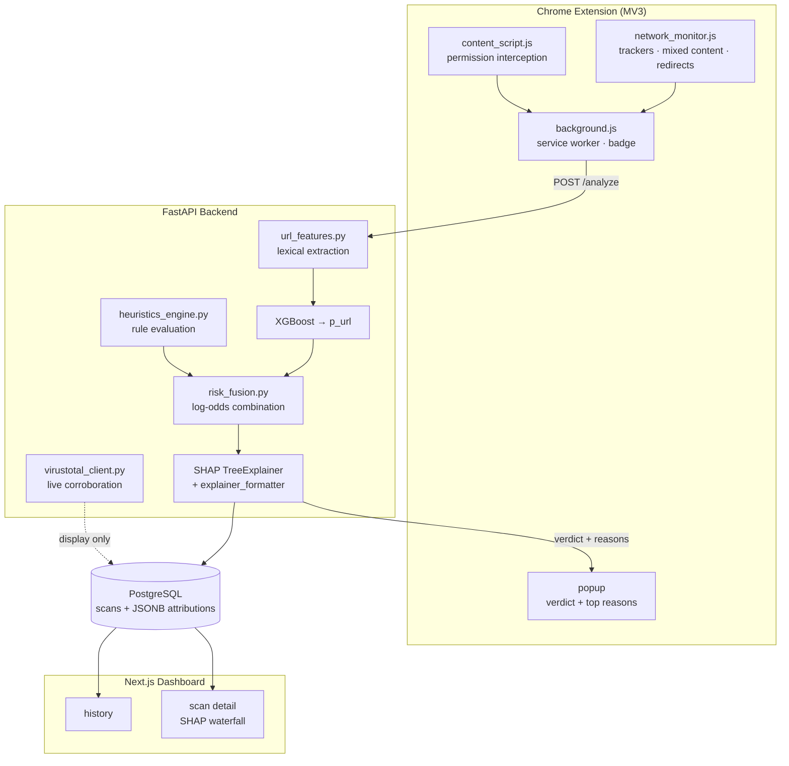

# Explainable Multi-Signal Phishing Detection in the Browser

**Final Year Project · 2026**

A Chrome extension and supporting service that judge whether the page you are on is a phishing or
scam site — and, crucially, tell you **why** in plain English rather than handing down a verdict
from a black box.

> ⚠️ **Status: in development.** This README documents the system under construction. Sections
> marked _pending_ are awaiting measurement — no result appears here until it has been produced by
> a script in this repository. Progress: [`ROADMAP.md`](ROADMAP.md) · [`PROJECT_STATE.md`](PROJECT_STATE.md)

---

## The problem

Blocklist extensions answer one question: *have I seen this URL before?* Since phishing domains are
routinely registered, used and abandoned inside a single day, the answer is often no — and the user
gets no warning at all. The extensions that do use machine learning tend to give the opposite
problem: a score with no reasoning, which a user can neither verify nor learn from.

This project targets the gap between them: **detection that generalises to URLs nobody has seen
before, and that explains itself.**

## The approach

Three independent families of signal, fused into one score, with attribution preserved end to end:

| Signal family | What it observes | How it is used |
|---|---|---|
| **Lexical URL structure** | Length, digit and special-character counts, subdomain depth, Shannon entropy, raw-IP hosts, high-risk TLDs, brand names outside the registrable domain | XGBoost features |
| **Browser network behaviour** | Third-party trackers loaded (matched against EasyPrivacy), mixed HTTP-on-HTTPS content, top-level redirect chain length | Transparent log-odds weights ([ADR-014](PROJECT_STATE.md#adr-014--transparent-log-odds-fusion-for-browser-signals)) |
| **Permission behaviour** | Camera, microphone, geolocation or notification access requested before the user has interacted with the page | Rule-based flags → log-odds weights |

The combination matters more than any part. A page with a spoofed-brand URL **and** thirty trackers
**and** a camera request before you have clicked anything is a far stronger signal than any one of
those alone — and it produces an explanation a person can actually read:

> ⚠️ **Phishing — 94% confident**
> - URL contains a well-known brand name in a suspicious position
> - Domain was registered only 2 days ago
> - Page requested access to your camera immediately on load

Every reason shown is an **additive log-odds contribution**: SHAP values for the model features,
documented weights for the browser signals. They live on the same scale, so they can be ranked
together in one honest list rather than glued together by presentation logic.

---

## Architecture



**Data flow, concretely.** The extension observes the page as it loads and posts the URL plus its
network and permission observations to `/analyze`. The backend extracts lexical features, scores
them with XGBoost, adjusts the log-odds by the browser-signal weights, computes SHAP attributions,
translates every feature name into a plain-English sentence, persists the scan, and returns the
verdict with its top three reasons. The popup renders it immediately; the dashboard offers the full
history and a per-scan waterfall breakdown.

---

## Scope: what a browser extension can and cannot see

Stated explicitly, because overclaiming here is the fastest way to lose credibility.

**It can see:** requests issued by tabs it has permission for (destination, headers, timing, size);
page-level permission prompts; cookies, storage access and script origins.

**It cannot see:** OS-level or other-application network traffic — there is no packet capture — or
the decrypted contents of HTTPS payloads.

This module is therefore **browser-level network and privacy monitoring**, not intrusion detection
and not network log analysis. The system is a lightweight, explainable alternative to blocklist
extensions, not a competitor to endpoint or enterprise security products.

## Design decisions worth defending

Four choices where the reasoning matters more than the outcome. Full records in
[`PROJECT_STATE.md`](PROJECT_STATE.md#architectural-decision-records).

**XGBoost rather than a neural network** ([ADR-002](PROJECT_STATE.md#architectural-decision-records)).
The feature set is deliberately small and tabular, which is exactly where gradient-boosted trees
excel. More importantly, SHAP's `TreeExplainer` is *exact* for tree ensembles, while attribution for
deep models is approximate. When explanation quality is the point of the project, that decides it.

**Rules for permission signals, not learning** ([ADR-003](PROJECT_STATE.md#architectural-decision-records)).
Permission abuse is near-binary — a page asking for your camera before you have touched it is
inherently suspicious — and no labelled corpus of per-URL permission timings exists. A documented
rule is faster, auditable, and produces a cleaner explanation than a learned coefficient would.

**VirusTotal is corroboration, not a feature** ([ADR-013](PROJECT_STATE.md#adr-013--virustotal-is-corroboration-not-a-feature)).
VirusTotal ingests PhishTank, so training on VT verdicts would be circular: the model would learn
the label and report metrics that measure nothing. VT is queried live and shown to the user as
independent evidence; it never enters the model and can never change a verdict.

**Browser signals fuse in log-odds space** ([ADR-014](PROJECT_STATE.md#adr-014--transparent-log-odds-fusion-for-browser-signals)).
No labelled dataset carries tracker counts, and fabricating them would be indefensible. Fixed,
documented weights added in log-odds space keep browser signals on the same additive scale as SHAP
values — so they appear in the same ranked explanation and the same waterfall chart. The weights
being hand-set rather than learned is a real limitation, and it is recorded as one.

---

## Evaluation plan

The project makes three claims, and each is tested rather than asserted. Full protocol in
[`ROADMAP.md` §Sprint 2](ROADMAP.md).

| Claim | Test |
|---|---|
| Generalises beyond a blocklist | Baseline table (blocklist · length-only · logistic regression · URL-only · fused) under a **temporal split** on PhishTank submission dates and an **unseen-registrable-domain holdout** |
| Genuinely multi-signal | Browser signals must measurably move the score and surface in explanations |
| Explanations are faithful | Top-3 SHAP features ablated to training medians; observed score shift compared against predicted shift |

Two further checks that a phishing detector should not ship without:

- **False-positive rate on the Tranco top-1000 with real deep paths.** A detector that flags
  Wikipedia is useless regardless of its F1.
- **Calibration** — reliability diagram, Brier score, Expected Calibration Error. The interface
  shows a confidence percentage; this is the evidence that number means something.

**Results: _pending_** — populated from `ml/reports/evaluation_report.md` once Sprint 2 completes.

### A note on the dataset

An audit on 2026-08-09 found the original training set was **trivially separable for the wrong
reason**: the legitimate class was built from Tranco bare domains (`https://example.com`) while the
phishing class was full PhishTank URLs with deep paths, so URL length alone nearly separated the
classes. Any headline metric from that dataset would have measured "does this URL have a path",
and the deployed extension would have flagged every legitimate deep link.

The dataset is being rebuilt with a path-bearing benign corpus, and `ml/scripts/audit_dataset.py`
reports per-feature single-feature AUC and class-conditional path-presence so the artifact cannot
silently return. The before/after audit is published in `ml/reports/` and discussed in the
evaluation chapter — **the honest, lower metric on the corrected dataset is the reportable result.**

---

## Running it

### Prerequisites

Docker and Docker Compose · Python 3.11+ · Node 20+ · a free
[VirusTotal API key](https://www.virustotal.com/gui/join-us) (optional — the system runs without
one; VT corroboration is simply omitted)

### Quick start

```bash
git clone <repo-url> && cd fyp
cp .env.example .env          # then fill in POSTGRES_PASSWORD and VIRUSTOTAL_API_KEY

cd docker && docker compose up --build
```

| Service | URL |
|---|---|
| Backend | http://localhost:8000 |
| API docs (Swagger) | http://localhost:8000/docs |
| Dashboard | http://localhost:3000 |

Confirm the ML core is actually live — this reports honestly rather than falling back silently
([ADR-016](PROJECT_STATE.md#adr-016--fail-loudly)):

```bash
curl http://localhost:8000/health
# {"status":"ok","model_loaded":true,"feature_count":9,"vt_key_configured":true,"db_reachable":true}
```

### Loading the extension

`chrome://extensions` → enable **Developer mode** → **Load unpacked** → select `extension/`.
Point `extension/config.js` at your backend if it is not on `localhost:8000`.

### Local development

```bash
python -m venv .venv && source .venv/bin/activate   # Windows: .venv\Scripts\activate
pip install -e "./backend[ml,dev]"

alembic -c backend/alembic.ini upgrade head          # database schema

python ml/scripts/prepare_dataset.py                 # raw CSVs → dataset.csv
python ml/scripts/audit_dataset.py                   # leakage / separability audit
python ml/scripts/generate_features.py               # dataset.csv → features.csv
python ml/scripts/train_model.py                     # → model.pkl + feature_columns.json

pytest tests/ -q

npm install                  # dashboard deps, installed once from the repo root (npm workspace)
npm run dev:dashboard        # or: cd dashboard && npm run dev
```

---

## Repository layout

| Path | Contents |
|---|---|
| `extension/` | Chrome MV3 extension — service worker, content script, network and permission monitors, popup |
| `backend/` | FastAPI service — routers, feature extraction, heuristics, fusion, VirusTotal client, ORM |
| `ml/` | Offline pipeline — dataset preparation, auditing, feature generation, training, SHAP, reports |
| `dashboard/` | Next.js 16 dashboard — history, scan detail, SHAP waterfall |
| `shared/` | Cross-component data — tracker list, brand list, feature-name templates |
| `tests/` | Unit, integration, manual and end-to-end tests |
| `docker/` | Compose stack: Postgres + backend + dashboard |

Training is strictly offline: `ml/` produces a model artifact, and the backend only ever loads it.

---

## Limitations

Stated up front rather than discovered by a reader.

- **Browser sandbox only.** No OS-level traffic, no other applications, no HTTPS payload contents.
- **Dataset freshness.** Trained on a PhishTank snapshot; phishing patterns that emerge afterwards
  are outside the training distribution. The temporal split is designed to measure exactly this decay.
- **Fusion weights are hand-set**, not learned ([ADR-014](PROJECT_STATE.md#adr-014--transparent-log-odds-fusion-for-browser-signals)) — a deliberate trade of statistical optimality for auditability, given no labelled corpus exists.
- **VirusTotal free tier** — 4 requests/minute, 500/day. Mitigated by a 1-hour TTL cache; because VT
  is display-only, exhaustion degrades corroboration and never the verdict.
- **Research scale.** A portfolio and research system, not a production security product.

Expanded in `LIMITATIONS.md` (Sprint 4).

---

## Data sources

| Source | Use | Licence / terms |
|---|---|---|
| [PhishTank](https://phishtank.org/) | Verified phishing URLs (label 1) | Free for research with attribution |
| [Tranco](https://tranco-list.eu/) | Popular domains — held out as a false-positive evaluation set | Research list, freely available |
| [EasyPrivacy](https://easylist.to/) | Tracker domain list (500 entries) | GPLv3 / CC BY-SA |
| Benign URL corpus | Path-bearing negatives (Sprint 1.2.2) | _Pending selection_ |

Exact download dates and row counts: `ml/data/raw/DATASET_SOURCES.md`.

---

## Documentation map

| File | Purpose |
|---|---|
| `README.md` | This file — what the project is and how to run it |
| [`ROADMAP.md`](ROADMAP.md) | Sprint plan, tasks, acceptance criteria |
| [`PROJECT_STATE.md`](PROJECT_STATE.md) | Current state, architectural decision records, activity log |
| `CLAUDE.md` | Working conventions and invariants for AI coding agents |
| `ml/reports/evaluation_report.md` | Measured results _(Sprint 4)_ |
| `LIMITATIONS.md` | Full scope statement _(Sprint 4)_ |
