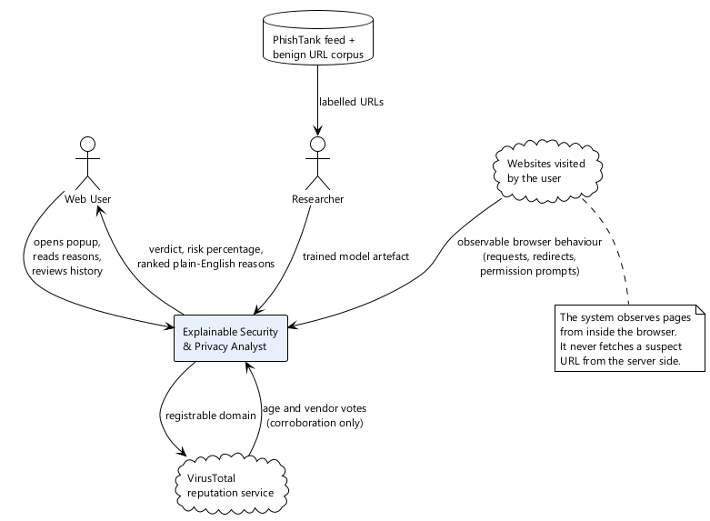

# Chapter 1 — Introduction

## 1.1 Background

Phishing has outlasted almost every countermeasure aimed at it. Filters improved, browsers began
warning users, and two-factor authentication became ordinary, yet credential theft through
deception remains one of the most common ways an attacker first gets inside a system. The
Anti-Phishing Working Group has recorded over a million distinct attacks in a single quarter
[1]. Verizon's annual breach analysis keeps finding that a majority of breaches involve a person
being manipulated rather than a system being broken [2]. The technique survives because it does
not attack the software. It attacks the judgement of whoever is looking at the screen.

Defences against it fall into three rough families.

**Blocklists** are the oldest and still the most widely deployed. Google Safe Browsing and
PhishTank distribute lists of URLs already confirmed malicious, and browsers consult them before
rendering a page [3], [4]. They are accurate on what they contain and useless on what they do not.
Since the median phishing site is live for hours rather than weeks, there is always a window in
which a site is dangerous and unlisted. Blocklists are, by construction, always behind.

**Heuristic rules** encode expert intuition: an IP address in place of a hostname, a hyphen-laden
subdomain, a recently registered domain. Rules generalise to unseen URLs, which blocklists cannot
do, but they are brittle and easy to evade once an attacker knows the rule.

**Machine-learned classifiers** learn structure from labelled corpora and generalise further than
hand-written rules. A large body of work reports strong results on lexical URL features
[5], [6], [7]. But the classifier's output is a number, and a number is where the trouble starts.

Consider what a user actually receives from each. A blocklist says *blocked*. A classifier says
*87% probability of phishing*. Neither says anything a person can act on, learn from, or dispute.
When the verdict is wrong — and on any realistic corpus it sometimes will be — the user has no
material with which to notice the mistake. When the verdict is right, they learn nothing that
helps them next time. The system has made a decision on their behalf and declined to explain it.

That gap is the subject of this project.

There is also a narrower technical gap. Almost all published URL classifiers operate on the URL
string alone, because that is what the public corpora contain. A URL string is a thin slice of what
a browser knows. By the time a page has rendered, the browser has also watched every request it
issued, every redirect it followed, and every capability it asked for. A page that quietly contacts
forty tracking domains, mixes insecure resources into a secure document, and demands camera access
before the user has clicked anything is describing itself rather clearly. None of that reaches a
URL-only model.

*Figure 1.1 — System context. The system observes pages from inside the browser and never fetches a
suspect URL from the server side.*

## 1.2 Problem statement

> Existing browser-based phishing defences either withhold their reasoning entirely or express it as
> a single opaque probability, and they judge a page almost exclusively on its URL string while
> ignoring the behavioural evidence the browser has already collected. A user therefore cannot tell
> why a page was flagged, cannot recognise when the judgement is wrong, and gains no transferable
> understanding of what made the page dangerous.

Two deficiencies are bound together here, and addressing only one leaves the problem intact.
Widening the evidence base without explaining the result produces a more accurate black box.
Explaining a URL-only model produces honest reasoning about impoverished evidence. The contribution
of this work lies in doing both at once, and specifically in doing it in a way where the added
evidence and the explanation remain on the same footing — where a browser-observed signal and a
learned feature can be ranked against each other and shown side by side rather than reported in
separate, incomparable units.

## 1.3 Aim and objectives

**Aim.** To design, build and evaluate a browser-resident system that assesses each page a user
visits using URL structure, network behaviour and permission behaviour together, and that returns
its verdict alongside the specific, individually quantified reasons for it in plain English.

The aim decomposes into seven objectives.

| # | Objective | Delivered in |
|---|---|---|
| **O1** | Specify the functional and non-functional requirements of a multi-signal, explanation-first page analyser, and model them as use cases with system-level contracts. | Chapter 2 |
| **O2** | Design a four-component architecture that keeps signal collection inside the browser, scoring on the server, and attribution intact end to end. | Chapter 3 |
| **O3** | Implement browser instrumentation that measures third-party tracker contact, mixed content and top-level redirect depth without re-fetching the page under assessment. | Chapter 4 |
| **O4** | Implement a URL classifier over lexical and brand features, trained on a corpus audited for separability artefacts. | Chapters 4, 5 |
| **O5** | Fuse browser-observed signals with the model's output on a single additive scale, so that both families of evidence appear in one ranked explanation. | Chapters 3, 4 |
| **O6** | Render every contribution as a plain-English sentence, with no internal identifier reaching any user-facing surface. | Chapter 4 |
| **O7** | Evaluate detection quality, calibration and explanation faithfulness under protocols that reflect deployment rather than flattering the model. | Chapter 5 |

Objectives O4 and O7 carry a constraint worth stating early, because it shapes the whole of
Chapter 5: every figure reported in this document is measured from a recorded run. None is
estimated, extrapolated, or carried forward from an earlier configuration. The reason for adopting
that rule so firmly is documented in Section 4.7, where an early version of the dataset produced an
F1 score that looked excellent and meant nothing.

## 1.4 Scope

The system observes what a browser can observe. That boundary is worth stating precisely, because
overclaiming it would be the easiest way to make the work look better than it is.

**Within scope**

- Pages loaded in a Chromium-based desktop browser by a user who has installed the extension.
- Three signal families: lexical URL structure; network behaviour during page load (third-party
  tracker contact, mixed content, top-level redirect depth); and permission-request behaviour
  (camera, microphone, geolocation and notification requests made before any user interaction).
- Assessment of the top-level document. Sub-frames contribute to network measurements but are not
  assessed independently.
- A recorded history of assessments, and a per-assessment report that reproduces the full
  attribution.

**Outside scope**

- Traffic generated outside the browser — other applications, background services, or the operating
  system itself. A phishing campaign delivered through a native email client is invisible here.
- The contents of encrypted payloads. The extension sees that a request occurred and where it went,
  not what it carried.
- Email, SMS and messaging as delivery channels. The system engages once a link has been opened.
- Page content analysis: rendered text, images, form structure and visual similarity to a
  legitimate brand are all deliberately excluded. They are a substantial research area in their own
  right, and folding them in would have meant doing several things shallowly instead of one thing
  properly.
- Mobile browsers, which do not support the extension APIs this design depends on.

The browser is not an arbitrary boundary. It is the last point at which the user's intent, the
page's identity and the page's behaviour are all simultaneously visible. An email gateway sees the
link but not what it does. A network appliance sees encrypted traffic but not which tab the user
was looking at. Inside the browser these facts coincide, and that is precisely what makes
multi-signal reasoning possible at all.

## 1.5 Contributions

The project makes three claims. Each is stated so that it can be falsified, and Chapter 5 is
organised around testing them rather than illustrating them.

**C1 — Detection generalises beyond a blocklist.**
The trained model identifies phishing URLs that are absent from the blocklist it was trained
against, under a temporal split in which every test URL was submitted later than every training
URL. Section 5.6 reports the comparison against four baselines, including the blocklist itself.

**C2 — Detection is genuinely multi-signal.**
Browser-observed signals measurably move the final score and appear in the ranked explanation
alongside model attributions. This is not automatic: an earlier revision computed those signals,
merged them into the feature vector, and then silently discarded them before scoring. Section 4.7.2
describes how the defect was found and Section 5.5.3 gives the test that now prevents it
recurring.

**C3 — Explanations are faithful rather than decorative.**
Neutralising the three highest-ranked reasons moves the score in the direction and by roughly the
magnitude those reasons predicted. Section 5.8 reports the ablation. Very few undergraduate
projects test their own explanations; asserting faithfulness without measuring it would undercut
the entire premise of the work.

A fourth outcome is methodological rather than technical, and is discussed in Sections 4.7.1 and
5.4. During development the training corpus was found to be trivially separable for a reason that
had nothing to do with phishing: the benign class consisted of bare domains while the malicious
class consisted of full URLs with paths, so URL length alone came close to solving the task. The
audit script written to quantify that flaw, and the before-and-after comparison it produced, are
presented here as a deliverable in their own right.

## 1.6 Structure of this report

**Chapter 2** establishes what the system must do. It develops functional and non-functional
requirements, identifies actors, and models behaviour through a use case diagram, brief and
fully-dressed use case descriptions, system sequence diagrams, operation contracts, a domain model,
activity diagrams, and design-level interaction diagrams.

**Chapter 3** turns those requirements into a design: the layered architecture, the class model, the
database schema in both normalised and implemented form, and the component structure. Design
decisions are recorded as numbered records with their rationale, including the two that most shape
the system — treating reputation data as corroboration rather than as a learned feature, and fusing
browser signals in log-odds space.

**Chapter 4** documents construction. It covers the technology selections, the deployment topology,
and the algorithms in detail, then gives an account of the defects encountered during development
and how each was resolved.

**Chapter 5** evaluates. It sets out the test strategy, presents the unit, integration and system
test cases with their outcomes, and reports the model evaluation: dataset audit, baseline
comparison, temporal and unseen-domain protocols, calibration, explanation faithfulness, latency,
and false positives on popular deep-path URLs.

**Chapter 6** assesses the work against its objectives and claims, states its limitations without
softening them, and identifies what should follow.

---

*Chapter references are collected in the reference list at the end of this document.*
