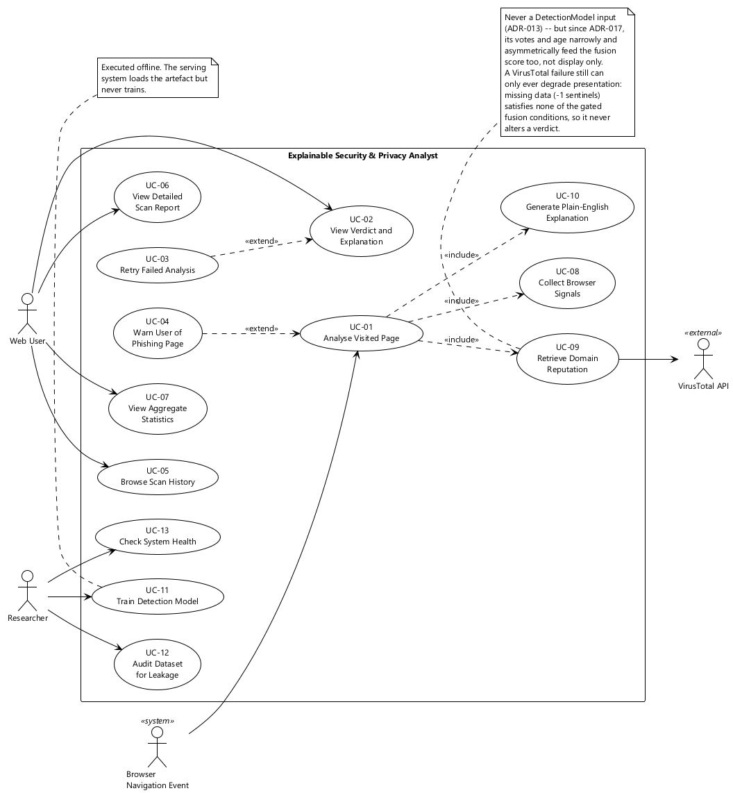
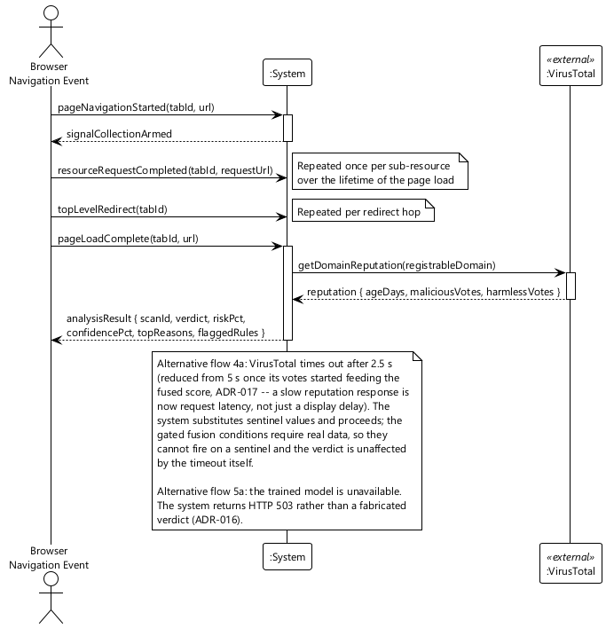
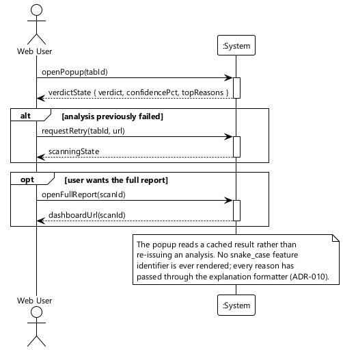
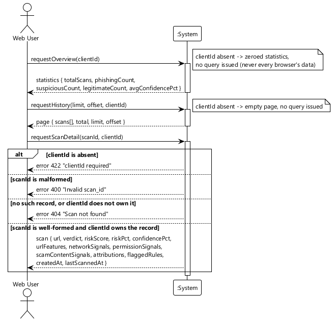
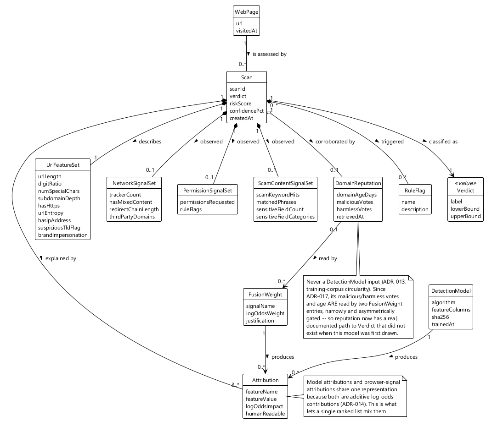
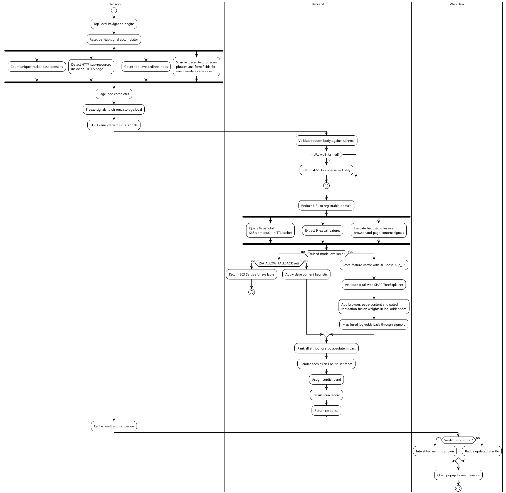
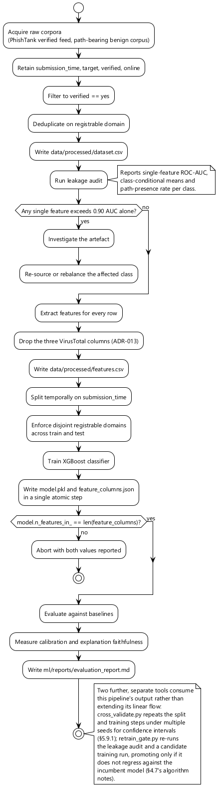
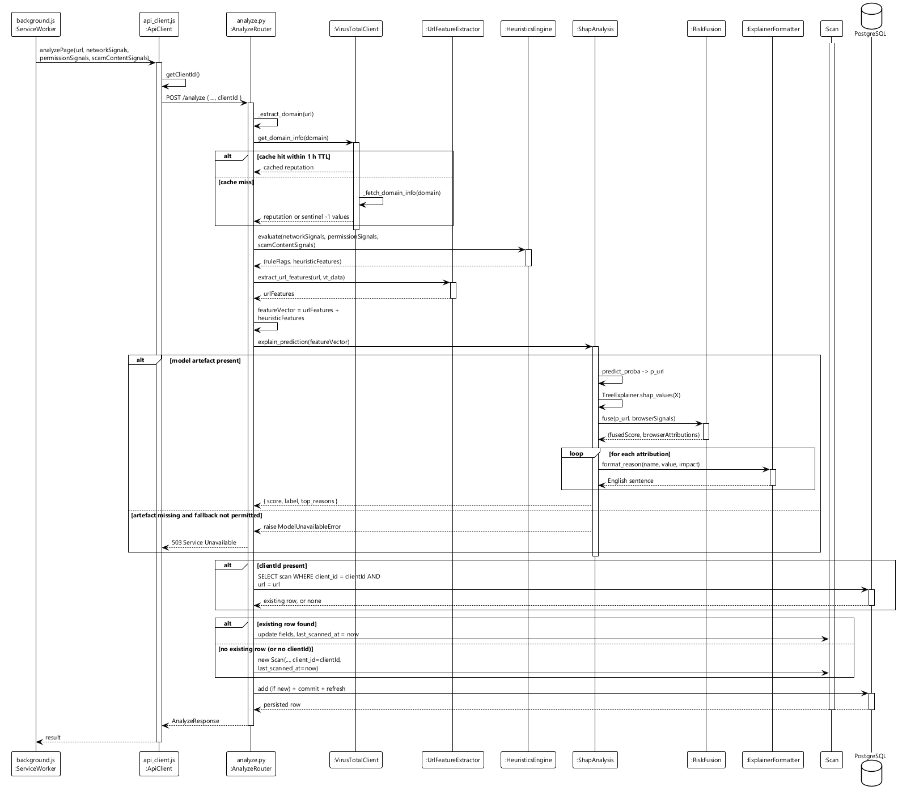
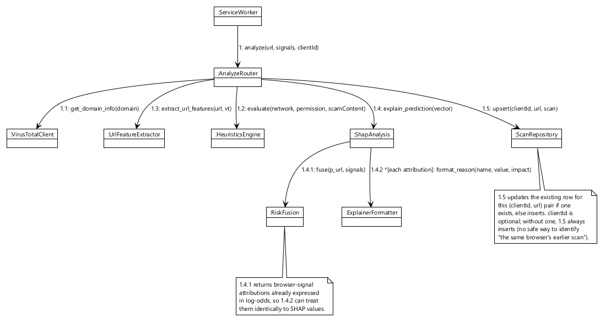

# Chapter 2 — System Analysis

## 2.1 Approach to requirements

There is no external client for this project, so requirements were derived rather than elicited.
Three sources fed into them.

The first was a review of how existing tools behave. Installing Google Safe Browsing's interstitial,
reading PhishTank's submission interface, and examining several published URL classifiers made the
functional baseline clear and, more usefully, made the gaps concrete. Safe Browsing interrupts
decisively but explains almost nothing; academic classifiers explain more but are not deployed
anywhere a user would encounter them.

The second was the set of browser capabilities available under Manifest V3 [22]. Requirements that a
browser extension cannot satisfy are not requirements, they are wishes, so the `webRequest` [23],
`webNavigation` and content-script APIs were surveyed before any behaviour was specified. This
ruled out several things early — response body inspection, for instance, which MV3 removed.

The third was the explainability literature, which imposed a constraint that turned out to drive
much of the design: if the intention is to show a user why a decision was made, the attribution
method has to be exact rather than approximate, and it has to produce contributions that sum to the
prediction. That requirement eliminated whole families of model architecture before a single
classifier was trained.

Requirements are identified as **FR-nn** and **NFR-nn** and are traced to use cases in Section 2.6
and to test cases in Chapter 5.

## 2.2 Functional requirements

### 2.2.1 Observation

| ID | Requirement | Priority |
|---|---|---|
| **FR-01** | The extension shall begin collecting signals when a top-level navigation starts, and shall discard any signals accumulated for a previous document in that tab. | Must |
| **FR-02** | The extension shall count distinct third-party tracker domains contacted during page load, resolving subdomains to their listed base domain so that one tracker is counted once. | Must |
| **FR-03** | The extension shall record whether any insecure HTTP sub-resource was loaded into a document served over HTTPS. | Must |
| **FR-04** | The extension shall count redirect hops on the top-level frame only, excluding sub-frame redirects. | Must |
| **FR-05** | The extension shall record camera, microphone, geolocation and notification requests made before the user has interacted with the page. | Must |
| **FR-06** | The extension shall persist per-tab signals to extension storage keyed by tab identifier, and shall not rely on service-worker memory surviving between events. | Must |
| **FR-07** | The system shall not issue any outbound request to the URL under assessment from the server side. | Must |
| **FR-32** | The extension shall scan the page's own rendered text for multi-word scam-indicator phrases and its form fields for combinations of sensitive-data categories, and shall report a distinct-phrase count and a distinct-category count to the service. | Must |
| **FR-33** | The extension shall detect navigation to a localhost, loopback, or RFC1918/link-local address before invoking analysis, and shall present a dedicated non-verdict state rather than submitting the address for scoring. | Must |

### 2.2.2 Assessment

| ID | Requirement | Priority |
|---|---|---|
| **FR-08** | The service shall extract lexical features from a submitted URL: length, digit density, special-character count, subdomain depth, scheme security, Shannon entropy, raw-IP-address usage, high-risk top-level domain, and brand impersonation. | Must |
| **FR-09** | The service shall evaluate rule flags over the submitted browser and page-content signals and derive numeric heuristic features from them. | Must |
| **FR-10** | The service shall score the lexical feature vector with a trained gradient-boosted classifier. | Must |
| **FR-11** | The service shall combine the classifier output with browser-signal contributions on a single additive scale to produce the final score. | Must |
| **FR-12** | The service shall assign a verdict of *phishing* above 0.70, *suspicious* between 0.40 and 0.70 inclusive of the lower bound, and *legitimate* below 0.40. | Must |
| **FR-13** | The service shall retrieve domain reputation from an external service for display, and shall produce an identical verdict whether or not that retrieval succeeds. | Must |
| **FR-14** | The service shall refuse to return a verdict when the trained model is unavailable, unless a development override is explicitly set. | Must |
| **FR-15** | The service shall reject a feature vector containing a key it does not recognise, rather than discarding the key. | Must |

### 2.2.3 Explanation

| ID | Requirement | Priority |
|---|---|---|
| **FR-16** | The service shall compute an individual contribution for every feature considered, using an attribution method that is exact for the model class in use. | Must |
| **FR-17** | The service shall rank contributions by absolute magnitude and return at least the three largest. | Must |
| **FR-18** | The service shall render every returned contribution as an English sentence. No internal feature identifier shall appear on any user-facing surface. | Must |
| **FR-19** | Browser-signal contributions and model contributions shall be returned in one list, in a single representation, distinguishable only by name. | Must |

### 2.2.4 Presentation and record-keeping

| ID | Requirement | Priority |
|---|---|---|
| **FR-20** | The extension shall indicate the current tab's verdict on the toolbar badge without requiring user action. | Must |
| **FR-21** | The extension popup shall present the verdict, a confidence percentage and the ranked reasons. | Must |
| **FR-22** | The extension shall interrupt the page with a dismissible full-page warning when, and only when, the verdict is *phishing*. | Should |
| **FR-23** | The popup shall offer a retry when an assessment failed. | Should |
| **FR-24** | The service shall durably persist the most recent assessment of each URL per browser, with its features, signals, attributions and flags, updating an existing record in place when the same browser re-assesses a URL it has already scanned rather than accumulating a duplicate. | Must |
| **FR-25** | The dashboard shall list assessments in reverse chronological order with pagination, scoped to the requesting browser's client identifier; a request carrying no client identifier shall return an empty list rather than every browser's history. | Must |
| **FR-26** | The dashboard shall present a single assessment in full, including a chart of the ranked contributions, only to a request whose client identifier matches the assessment's owner; a mismatched or absent identifier shall be reported identically to a non-existent assessment. | Must |
| **FR-27** | The dashboard shall present aggregate counts by verdict and mean decisiveness. | Should |
| **FR-28** | The service shall expose a health endpoint reporting model load state, feature count, model digest, reputation-key configuration and database reachability. | Must |

### 2.2.5 Offline pipeline

| ID | Requirement | Priority |
|---|---|---|
| **FR-29** | The training pipeline shall report, per feature, the discriminative power of that feature alone, and shall flag any feature that separates the classes on its own. | Must |
| **FR-30** | The training pipeline shall write the model artefact and its feature-column manifest in one operation, and the service shall refuse to load a mismatched pair. | Must |
| **FR-31** | The evaluation pipeline shall report results under a temporal split and under a split with disjoint registrable domains. | Must |

## 2.3 Non-functional requirements

| ID | Category | Requirement | Verification |
|---|---|---|---|
| **NFR-01** | Performance | 95th-percentile assessment latency shall not exceed 10 s with a cold reputation cache, or 1 s with a warm cache. | TC-P-01 |
| **NFR-02** | Performance | Signal collection shall not measurably delay page rendering; no listener shall block a request. | TC-P-02 |
| **NFR-03** | Reliability | A reputation-service failure shall degrade display only, never the verdict. | TC-I-04 |
| **NFR-04** | Reliability | No failure path shall return a fabricated verdict in a deployed configuration. | TC-I-05 |
| **NFR-05** | Reliability | Service-worker termination shall not lose collected signals. | TC-S-03 |
| **NFR-06** | Usability | No user-facing text shall contain an internal identifier, in any state of any surface. | TC-U-01 |
| **NFR-07** | Usability | A verdict and its principal reason shall be legible without scrolling in the popup. | TC-U-02 |
| **NFR-08** | Security | The extension shall request the narrowest permission set that supports its stated function. | TC-SEC-01 |
| **NFR-09** | Security | Request bodies shall be validated against a schema before any processing. | TC-SEC-02 |
| **NFR-10** | Security | Credentials shall be supplied through the environment and shall not appear in source control. | TC-SEC-03 |
| **NFR-11** | Privacy | Browsing data shall leave the browser only as the URL under assessment and its derived counts. | TC-SEC-04 |
| **NFR-12** | Maintainability | Every merge to the main branch shall pass lint, type-check and the full test suite. | TC-M-01 |
| **NFR-13** | Portability | The service and its database shall start from a single command on any Docker host. | TC-M-02 |
| **NFR-14** | Integrity | Every quantitative figure in the evaluation shall come from a recorded execution. | Section 5.2 |
| **NFR-15** | Privacy | The per-browser client identifier used to scope history and detail requests shall be a locally-generated random value, never a login credential, and shall not itself be treated as an authentication token by any endpoint. | TC-SEC-06 |

## 2.4 Actors

| Actor | Type | Goal |
|---|---|---|
| **Web User** | Primary, human | To learn whether the page in front of them is dangerous, and why. |
| **Browser Navigation Event** | Primary, system | Represents the browser signalling that a document has begun or finished loading. Modelling this as an actor is deliberate: assessment is triggered by the browser, not by the user, and the use case model should say so. |
| **Researcher** | Primary, human | To build, audit and evaluate the detection model, and to verify the deployed system's health. |
| **VirusTotal API** | Supporting, external | Supplies domain age and vendor votes — displayed as corroboration, and, since ADR-017, narrowly and asymmetrically fused into the score. Never a trained model feature (ADR-013). |

The Web User and the Researcher may be the same person, but they are separated because their goals,
their surfaces and their failure modes have nothing in common.

## 2.5 Use case diagram

*Figure 2.1 — System use case diagram.*

Two relationships are worth reading carefully. UC-04 *extends* UC-01 rather than being included by
it, because interruption is conditional on the verdict rather than part of every assessment.
UC-09 is *included* by UC-01 even though its result never changes the verdict, because the
retrieval always happens and its output is always displayed.

## 2.6 Brief use case descriptions

| ID | Use case | Primary actor | Brief description | Requirements |
|---|---|---|---|---|
| **UC-01** | Analyse Visited Page | Browser Navigation Event | On completion of a top-level page load, the system gathers the signals accumulated during the load, scores the page, produces a ranked explanation, records the assessment, and returns the verdict to the extension. | FR-01…FR-19, FR-24 |
| **UC-02** | View Verdict and Explanation | Web User | The user opens the toolbar popup and reads the verdict, the confidence percentage, and the ranked plain-English reasons for the current tab. | FR-21, FR-18 |
| **UC-03** | Retry Failed Analysis | Web User | Where an assessment failed, the user asks for it to be attempted again. | FR-23 |
| **UC-04** | Warn User of Phishing Page | Web User | When a page is classified as phishing, the system blurs the document and presents a warning naming the principal reasons, which the user may dismiss. | FR-22 |
| **UC-05** | Browse Scan History | Web User | The user reviews previous assessments in reverse chronological order, paginated. | FR-25 |
| **UC-06** | View Detailed Scan Report | Web User | The user opens one assessment and sees its full record, including a chart of contributions. | FR-26 |
| **UC-07** | View Aggregate Statistics | Web User | The user sees counts by verdict and mean decisiveness across all assessments. | FR-27 |
| **UC-08** | Collect Browser Signals | Browser Navigation Event | Throughout a page load the extension accumulates tracker contacts, mixed-content occurrences, redirect hops and early permission requests, freezing them on completion. A separate isolated-world content script scans the rendered page text and form fields for scam-indicator phrases and sensitive-field combinations on the same page load. | FR-01…FR-06, FR-32 |
| **UC-09** | Retrieve Domain Reputation | — (included) | The service obtains domain age and vendor votes for the registrable domain, from cache where possible. | FR-13 |
| **UC-10** | Generate Plain-English Explanation | — (included) | Each contribution is converted into a sentence a non-specialist can read. | FR-16…FR-19 |
| **UC-11** | Train Detection Model | Researcher | The researcher prepares a corpus, audits it, extracts features, trains a classifier, and writes the artefact with its column manifest. | FR-29, FR-30 |
| **UC-12** | Audit Dataset for Leakage | Researcher | The researcher measures each feature's standalone discriminative power and the structural balance of the classes, and flags artefacts. | FR-29 |
| **UC-13** | Check System Health | Researcher | The researcher queries the health endpoint and confirms the model, database and configuration are as expected. | FR-28 |

## 2.7 Detailed use case descriptions

### UC-01 — Analyse Visited Page

| Field | Content |
|---|---|
| **Use case** | UC-01 Analyse Visited Page |
| **Scope** | Explainable Security & Privacy Analyst |
| **Level** | User goal |
| **Primary actor** | Browser Navigation Event |
| **Stakeholders and interests** | *Web User*: wants an accurate verdict quickly, and wants the reasons to be truthful. *Researcher*: wants the assessment recorded in full so that it can be audited later. *Site operator*: has an interest in not being wrongly accused, which makes false positives costly. |
| **Preconditions** | The extension is installed and enabled. A top-level navigation has completed for a tab whose URL scheme is `http` or `https`. The service is reachable. |
| **Success guarantee** | A verdict, a risk percentage, a confidence percentage and at least three ranked reasons are returned and cached against the tab. A durable record of the assessment exists. The badge reflects the verdict. |
| **Trigger** | The browser reports `status === "complete"` for a tab. |

**Main success scenario**

1. The browser signals that the page load is complete.
2. The extension retrieves the signals accumulated for that tab during the load.
3. The extension submits the URL together with the network and permission signals to the service.
4. The service validates the submission against its schema.
5. The service reduces the URL to its registrable domain and obtains that domain's reputation
   *(include UC-09)*.
6. The service evaluates rule flags over the submitted signals and derives numeric heuristic
   features.
7. The service extracts lexical features from the URL.
8. The service scores the lexical feature vector with the trained classifier.
9. The service attributes the score across the features and adds the browser-signal contributions
   on the same scale.
10. The service ranks all contributions by absolute magnitude and renders each as a sentence
    *(include UC-10)*.
11. The service assigns a verdict band from the fused score.
12. The service records the assessment.
13. The service returns the verdict, scores, reasons and flags.
14. The extension caches the result against the tab and updates the badge.

**Extensions**

| Step | Condition and handling |
|---|---|
| 3a | *The service is unreachable.* The extension stores an error state for the tab, sets a neutral badge, and offers a retry through UC-03. Signals are retained so the retry need not re-observe them. |
| 4a | *The submission fails validation.* The service responds 422 with the offending field. No record is written. |
| 5a | *Reputation retrieval times out after 5 s, or the key is absent.* Sentinel values of −1 are substituted. Processing continues from step 6. The verdict is unaffected; only the corroboration panel changes. This is a designed outcome, not a degraded one. |
| 8a | *No model artefact is present, or its column manifest disagrees with it.* If the development override is unset, the service responds 503 and writes no record. If the override is set, a documented heuristic substitutes and the response is marked accordingly. |
| 9a | *The feature vector contains a key the attribution layer does not recognise.* The service raises rather than dropping the key. Silently discarding unknown keys was a real defect in an earlier revision; see Section 4.7.2. |
| 11a | *The fused score falls exactly on 0.40.* The lower bound is inclusive, so the verdict is *suspicious*. |
| 12a | *The database write fails.* The service responds 500. The extension surfaces an error state; no partial record persists, since the write is transactional. |

| Field | Content |
|---|---|
| **Special requirements** | NFR-01 latency budget; NFR-03 reputation independence; NFR-04 no fabricated verdicts; NFR-06 no internal identifiers in output. |
| **Technology and data variations** | Reputation provider is pluggable at the client boundary. The model artefact may be replaced without code change provided its manifest matches. |
| **Frequency** | Once per top-level navigation; tens to hundreds of times per browsing hour. |
| **Open issues** | Whether repeated assessment of the same URL within a short window should be suppressed to conserve the reputation-service quota. Deferred; the response cache partially addresses it. |

### UC-02 — View Verdict and Explanation

| Field | Content |
|---|---|
| **Use case** | UC-02 View Verdict and Explanation |
| **Level** | User goal |
| **Primary actor** | Web User |
| **Preconditions** | The extension is installed. A tab is active. |
| **Success guarantee** | The user sees the state of the current tab's assessment, and where one succeeded, its verdict, confidence and ranked reasons. |
| **Trigger** | The user clicks the toolbar icon. |

**Main success scenario**

1. The user clicks the toolbar icon.
2. The popup reads the cached entry for the active tab.
3. The popup selects the presentation state matching the entry: scanning, safe, suspicious,
   phishing, or error.
4. The popup renders the verdict, the confidence percentage and the ranked reasons.
5. The user reads the reasons and closes the popup.

**Extensions**

| Step | Condition and handling |
|---|---|
| 2a | *No entry exists for the tab.* The popup shows an idle state inviting a reload. |
| 3a | *The entry is in the scanning state.* A progress state is shown; the popup does not block. |
| 3b | *The entry is in the error state.* The failure is described in non-technical terms and a retry is offered *(extend UC-03)*. |
| 4a | *Fewer than three contributions were returned.* Whatever was returned is shown. The popup never pads the list. |
| 5a | *The user wants the full record.* A link opens the corresponding dashboard report *(leads to UC-06)*. |

| Field | Content |
|---|---|
| **Special requirements** | NFR-06, NFR-07. The popup performs no arithmetic on returned percentages; it displays what it was given. |
| **Frequency** | On demand, considerably less often than UC-01. |

### UC-04 — Warn User of Phishing Page

| Field | Content |
|---|---|
| **Use case** | UC-04 Warn User of Phishing Page |
| **Level** | User goal |
| **Primary actor** | Web User |
| **Preconditions** | UC-01 has completed for the active tab and returned a verdict of *phishing*. |
| **Success guarantee** | The document is obscured and a warning naming the principal reasons is displayed. The user has either left the page or explicitly chosen to continue. |
| **Trigger** | An assessment result with verdict *phishing* arrives for a tab the user is viewing. |

**Main success scenario**

1. The service worker forwards the phishing result to the tab's content script.
2. The content script applies a blur to the document and injects a warning panel above it.
3. The panel names the top three reasons in plain English and offers two actions.
4. The user selects *Leave this page*.
5. The tab is closed.

**Extensions**

| Step | Condition and handling |
|---|---|
| 2a | *The document has already navigated away.* The injection is abandoned. |
| 4a | *The user selects "I understand the risks, continue".* The overlay is removed for this document only. A subsequent navigation to the same URL warns again; no bypass is persisted. |
| 4b | *The user ignores the panel.* It remains until the document navigates. It is not auto-dismissed. |

| Field | Content |
|---|---|
| **Special requirements** | The overlay is raised only above 0.70. A false interruption is far more damaging to trust than a missed badge, so the *suspicious* band deliberately does not trigger it. |
| **Open issues** | Whether repeated dismissal for a given domain should be remembered. Not implemented: a remembered bypass is an attack surface. |

### UC-11 — Train Detection Model

| Field | Content |
|---|---|
| **Use case** | UC-11 Train Detection Model |
| **Level** | Subfunction (offline) |
| **Primary actor** | Researcher |
| **Preconditions** | Raw corpora are present. The Python environment is provisioned. |
| **Success guarantee** | A model artefact and a matching column manifest exist, written by one execution, together with recorded metrics under both evaluation protocols. |
| **Trigger** | The researcher runs the training pipeline. |

**Main success scenario**

1. The researcher runs corpus preparation, retaining submission timestamps, targets and
   verification status.
2. The researcher runs the leakage audit and inspects the report *(include UC-12)*.
3. The researcher runs feature extraction over the prepared corpus.
4. The researcher runs training, which fits the classifier and writes the artefact and manifest
   together.
5. The pipeline verifies that the artefact's input arity equals the manifest length.
6. The pipeline evaluates against baselines under both split protocols and writes the report.

**Extensions**

| Step | Condition and handling |
|---|---|
| 2a | *A feature separates the classes on its own.* Training is abandoned. The corpus is investigated and rebuilt. This path was taken during development; Section 4.7.1 documents it. |
| 5a | *Arity and manifest length disagree.* The pipeline aborts, reporting both values. |
| 6a | *Measured performance falls below the previous configuration.* The result is recorded as measured. Test-set tuning is not performed. |

## 2.8 System sequence diagrams

A system sequence diagram treats the system as one opaque participant and records only the events
crossing its boundary. The diagrams below therefore name no internal component; those appear in
Section 2.12.

*Figure 2.3 — System sequence diagram for UC-01 Analyse Visited Page.*

Three of the four inbound events in Figure 2.3 arrive repeatedly and asynchronously during the load,
and only the fourth produces a response. This asymmetry is the reason signals must be durable
(FR-06): the events that gather evidence and the event that consumes it are separated by an
interval in which the service worker may be terminated.

*Figure 2.4 — System sequence diagram for UC-02 View Verdict and Explanation.*

*Figure 2.5 — System sequence diagram for UC-05, UC-06 and UC-07.*

## 2.9 Operation contracts

Contracts are given for the system operations identified in Section 2.8. Postconditions are
expressed as state changes observed after the operation completes, in the declarative style, rather
than as procedural steps.

### Contract CO-01: pageNavigationStarted

| Field | Content |
|---|---|
| **Operation** | `pageNavigationStarted(tabId : int, url : String)` |
| **Cross references** | UC-01, UC-08 |
| **Preconditions** | The navigation targets the top-level frame (`frameId == 0`). |
| **Postconditions** | • A `TabSignal` instance was created (instance creation). • `TabSignal.trackerCount` was set to 0, `hasMixedContent` to false, `redirectChainLength` to 0 (attribute modification). • `TabSignal.topLevelUrl` was set to `url` (attribute modification). • The `TabSignal` was associated with `tabId` (association formed). • Any `TabSignal` previously associated with `tabId` was released (association broken). |

### Contract CO-02: resourceRequestCompleted

| Field | Content |
|---|---|
| **Operation** | `resourceRequestCompleted(tabId : int, requestUrl : String)` |
| **Cross references** | UC-08; FR-02, FR-03 |
| **Preconditions** | A `TabSignal` is associated with `tabId`. `requestUrl` parses to a hostname. |
| **Postconditions** | • If the hostname or an ancestor of it matches a listed tracker, that base domain was added to `TabSignal.trackerDomainsSeen` (association formed) and `trackerCount` was set to the cardinality of that set (attribute modification). • If `topLevelUrl` uses `https` and `requestUrl` uses `http`, `hasMixedContent` was set to true (attribute modification). • No other state changed. |

### Contract CO-03: topLevelRedirect

| Field | Content |
|---|---|
| **Operation** | `topLevelRedirect(tabId : int)` |
| **Cross references** | UC-08; FR-04 |
| **Preconditions** | The redirect occurred on the top-level frame. |
| **Postconditions** | • `TabSignal.redirectChainLength` was increased by one (attribute modification). |

### Contract CO-04: pageLoadComplete

| Field | Content |
|---|---|
| **Operation** | `pageLoadComplete(tabId : int, url : String)` |
| **Cross references** | UC-01; FR-06…FR-19, FR-24 |
| **Preconditions** | The scheme of `url` is `http` or `https`. The extension is enabled for the tab. |
| **Postconditions** | • The accumulated signals were made durable under a key derived from `tabId` (attribute modification). • If a `Scan` already exists with the same `clientId` and `url`, its `verdict`, `riskScore`, `riskPct`, `confidencePct`, feature sets and `lastScannedAt` were updated in place (attribute modification); otherwise a new `Scan` instance was created (instance creation) with `clientId` set from the caller. A caller supplying no `clientId` always creates a new instance, since there is no safe way to identify "this same browser's earlier scan" without one. • `Scan.url`, `verdict`, `riskScore`, `riskPct`, `confidencePct` and `createdAt` (on creation) or `lastScannedAt` (on update) were set (attribute modification). • The `Scan` was associated with one `UrlFeatureSet`, at most one `NetworkSignalSet`, at most one `PermissionSignalSet`, at most one `ScamContentSignalSet` and at most one `DomainReputation` (associations formed or updated). • The `Scan` was associated with three or more `Attribution` instances, each carrying a name, a value, a log-odds impact and a rendered sentence (instances created, associations formed). • The `Scan` was associated with zero or more `RuleFlag` instances (associations formed). • The `Scan` was associated with exactly one `Verdict` determined by the band containing `riskScore` (association formed). • The badge state for `tabId` was set from the verdict (attribute modification). |

*Note.* If the model is unavailable and no override is set, none of the above holds: no `Scan` is
created or updated and the operation fails with 503. A contract that quietly permitted a fabricated
`Scan` here would misrepresent the system's actual guarantee. The update-in-place behaviour was
added after this contract was first written, so that a browser re-checking a URL it has already
scanned accumulates one current record per URL rather than an unbounded history of identical
re-scans; FR-24's "persist every assessment" is satisfied by the *latest* assessment always being
durable, not by every individual re-scan being retained as a separate row.

### Contract CO-05: requestScanDetail

| Field | Content |
|---|---|
| **Operation** | `requestScanDetail(scanId : String)` |
| **Cross references** | UC-06 |
| **Preconditions** | None. |
| **Postconditions** | • No state changed. This is a query. • A representation of the `Scan` identified by `scanId`, together with its associated feature sets, attributions and flags, was returned; or a not-found condition was reported; or, where `scanId` is not a well-formed identifier, a bad-request condition was reported. |

### Contract CO-06: requestHistory

| Field | Content |
|---|---|
| **Operation** | `requestHistory(limit : int, offset : int)` |
| **Cross references** | UC-05 |
| **Preconditions** | `0 < limit ≤ 200`; `offset ≥ 0`. |
| **Postconditions** | • No state changed. • A sequence of `Scan` representations ordered by `createdAt` descending, of length at most `limit`, beginning at `offset`, together with the total count, was returned. |

### Contract CO-07: requestRetry

| Field | Content |
|---|---|
| **Operation** | `requestRetry(tabId : int, url : String)` |
| **Cross references** | UC-03 |
| **Preconditions** | An entry in the error state is associated with `tabId`. |
| **Postconditions** | • The entry associated with `tabId` was set to the scanning state (attribute modification). • A reload of the tab was requested, which re-triggers CO-01 and, in due course, CO-04. |

## 2.10 Domain model

*Figure 2.2 — Domain (conceptual) model.*

Two features of this model carry most of its weight.

`Attribution` has a single definition used by both `DetectionModel` and `FusionWeight`. This is
not an economy of drawing. A SHAP value is an additive contribution in log-odds space, and a fusion
weight is also an additive contribution in log-odds space, so the two are commensurable and can be
compared directly. Had the browser signals been given their own class with their own units, every
downstream element — the ranking, the chart, the stored record, the sentence templates — would have
needed to handle two kinds of evidence. The conceptual decision to unify them is what keeps the rest
of the system simple, and it is the reason the design records treat this as a foundational choice
rather than an implementation detail.

`DomainReputation` is attached by aggregation rather than composition, and no association runs from
it *directly* to `Verdict` — it is never a `DetectionModel` input (ADR-013's training-corpus
circularity argument, unchanged). That is the diagrammatic expression of FR-13. What the model no
longer shows, because it changed partway through the project, is "reputation data plays no role in
the reasoning at all": since ADR-017, two of its fields are read by `FusionWeight` entries under a
narrowly gated, asymmetric rule (§3.2.6), giving `DomainReputation` a real — if indirect, documented
and tightly bounded — path to `Verdict` through the same `Attribution` mechanism browser signals
already used. `ScamContentSignalSet`, added the same period, is a fifth signal family aggregated
onto `Scan` alongside the network and permission sets, and reaches `Verdict` the same way they do.

## 2.11 Activity diagrams

*Figure 2.6 — Activity diagram for the end-to-end assessment of a page, partitioned by responsibility.*

The three parallel measurement activities in the extension partition are genuinely concurrent: they
are independent event listeners, and nothing orders them. The three parallel activities in the
service — reputation retrieval, lexical extraction and rule evaluation — are also independent, and
only reputation retrieval touches the network. The two decision nodes in the service partition are
the fail-loud gates required by FR-14.

*Figure 2.7 — Activity diagram for the offline training pipeline.*

The audit gate in Figure 2.7 is placed before feature extraction rather than after training. A
corpus that fails the audit should never reach a classifier, because once metrics exist there is a
strong temptation to keep them.

## 2.12 Design-level interaction diagrams

*Figure 2.8 — Sequence diagram for the assessment operation, showing internal collaborations.*

Figure 2.8 refines Figure 2.3 by opening the system boundary. Three points are worth drawing out.

Reputation retrieval precedes feature extraction because the extraction signature accepts the
reputation payload; the values are carried for display and are excluded from the trained column set.

The `alt` fragment around the reputation client shows the cache as a control-flow decision rather
than a hidden optimisation. With a one-hour window and a free-tier allowance of four requests per
minute, the cache is what makes repeat browsing viable at all.

The loop that renders each attribution runs after fusion, not before, so that model contributions
and browser-signal contributions enter the formatter through the same call.

The final `alt` fragment — query, then update-or-insert — is a later addition to this diagram, added
alongside multi-browser scoping (§4.7's algorithm notes, CO-04). It replaced an unconditional insert:
persistence is now keyed by `(clientId, url)` rather than being append-only, which is what makes
`GET /history` show one current row per URL a browser has visited rather than growing without bound
across repeat visits to the same page.

*Figure 2.9 — Communication diagram for the same collaboration.*

The numbering in Figure 2.9 shows how shallow the call graph is. Only the attribution step reaches a
third level, and the router itself never calls anything below its immediate collaborators. That
flatness was a design goal: an orchestration function that reaches three or four levels down becomes
impossible to test without extensive mocking, and the integration test in Section 5.5.2 patches
exactly four collaborators as a result.
