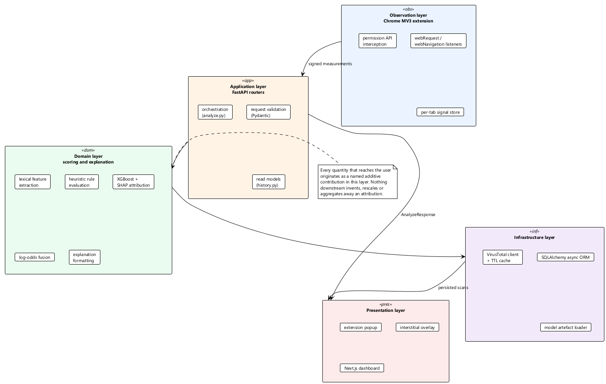
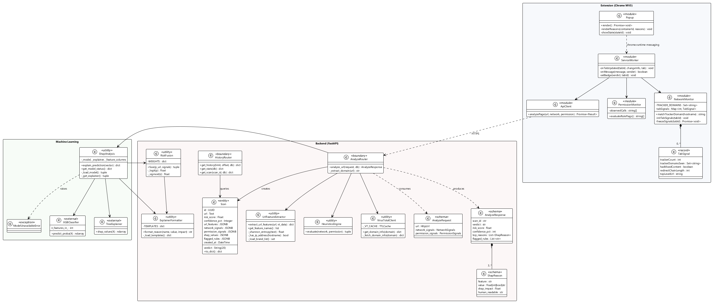
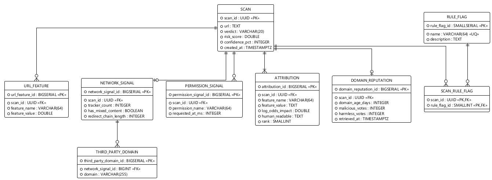
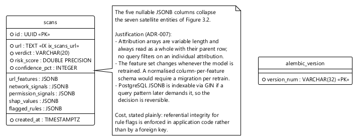
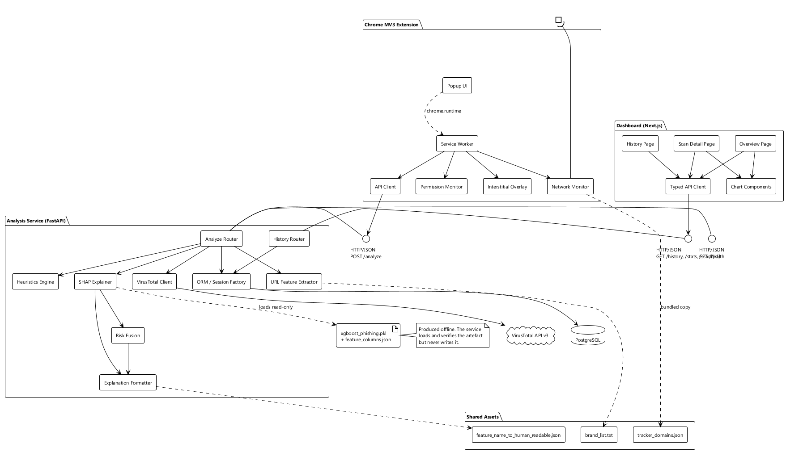

# Chapter 3 — System Design

## 3.1 Architectural overview

The system is organised as five layers spread across four deployable components. The layering is
conventional; what is not conventional is the property the layering exists to protect.



*Figure 3.0 — Layered architecture and the attribution path.*

**The invariant that shapes the architecture.** Every number the user eventually reads traces back
to a named, additive contribution produced in the domain layer. No layer above it aggregates
contributions away, rescales them, or introduces a quantity of its own. This sounds like a
housekeeping rule. In practice it is the reason the system can claim to be explainable at all, and
it constrains the design in specific ways: the presentation layer performs no arithmetic, the
persistence layer stores attributions rather than summaries, and the transport schema carries the
attribution list rather than a rendered string.

A worked example makes the constraint concrete. An earlier revision of the popup displayed a "safe"
percentage by computing `100 − confidence` in JavaScript. That single subtraction placed a number in
front of the user that no layer below had produced, and it turned out to be masking a genuine
confusion between two different quantities in the service itself. The rule was tightened afterwards
(ADR-015, Section 3.2.4), and the popup now displays only what it was given.

### 3.1.1 Component responsibilities

| Component | Runtime | Responsibility | Explicitly not responsible for |
|---|---|---|---|
| **Extension** | Chrome MV3, V8 isolate | Observing browser behaviour; presenting verdicts; interrupting on the phishing band. | Scoring. It holds no model and makes no judgement of its own. |
| **Analysis service** | Python 3.11, ASGI | Feature extraction, scoring, fusion, attribution, sentence rendering, persistence. | Observation. It never contacts the page under assessment. |
| **Database** | PostgreSQL 15 | Durable record of every assessment with full attribution. | Any part of scoring. |
| **Dashboard** | Next.js 16 on Node 24 | Presenting history, aggregates and per-assessment detail. | Scoring, and any derivation of one displayed quantity from another. |

### 3.1.2 Why signals are collected in the browser and never re-fetched

The service receives counts. It could, in principle, fetch the URL itself and count trackers
server-side, and a reader might reasonably ask why it does not. There are three reasons, and they
are of quite different kinds.

The first is that it would be measuring the wrong thing. A server-side fetch executes no JavaScript,
carries no session, and comes from a datacentre address. Phishing infrastructure routinely serves
benign content under exactly those conditions — cloaking against crawlers is standard practice. The
page the server would see is not the page the user is looking at.

The second is security. Fetching a live phishing URL from the analysis service means deliberately
pulling attacker-controlled content into the trusted component, which is a poor trade for data the
browser already has.

The third is latency. The user is already waiting. A second full page load, serialised behind the
first, would put the assessment far outside the budget in NFR-01.

The consequence is that the service trusts the counts it is given. Under the deployment model this
is acceptable — the extension and the service are parts of one system, and a user who tampers with
their own extension can only mislead themselves. It would not be acceptable if the service accepted
submissions from arbitrary clients, and Section 6.3 records this as a limitation.

## 3.2 Design decisions

Decisions are recorded as numbered, dated records. They are append-only: a decision that turns out
to be wrong is superseded by a new record rather than edited, so that the reasoning history stays
legible. Four of the sixteen are set out in full below because they shape the system most; the
remainder are summarised in Table 3.1.

**Table 3.1 — Design decision register**

| # | Decision | Rationale in brief | Status |
|---|---|---|---|
| ADR-001 | Chrome Manifest V3 | MV2 is deprecated for new extensions; MV3 is the only forward-compatible target. | Active |
| ADR-002 | Gradient-boosted trees, not a neural network | Tabular features, modest corpus, no GPU. Decisively: SHAP's `TreeExplainer` is *exact* for tree ensembles, whereas deep-model attribution is approximate. Explainability drove the model class. | Active |
| ADR-003 | Rules for permission signals, not learned features | The signal is near-binary and no labelled corpus carries per-URL permission timings. A documented weight is auditable; a learned coefficient on fabricated data would not be. | Active |
| ADR-004 | One unified model, not three per-family models | Three pipelines would triple maintenance for no gain on a corpus this size. | Active |
| ADR-005 | FastAPI | Async-first, schema validation at the boundary, generated OpenAPI documentation. | Active |
| ADR-006 | Next.js App Router | Server rendering, TypeScript throughout, straightforward deployment. | Active |
| ADR-007 | PostgreSQL with JSONB for variable-length payloads | See Section 3.4.2. | Active |
| ADR-008 | Reputation via VirusTotal rather than WHOIS | WHOIS is slow, rate-limited and inconsistently formatted; one VirusTotal call returns age and vendor votes together. | Amended by ADR-013 |
| ADR-009 | Report a confidence percentage alongside the raw score | "87% confident" is more legible than "0.87". | Superseded by ADR-015 |
| ADR-010 | Every feature name is translated before it reaches a user surface | See Section 3.2.1. | Active |
| ADR-011 | Explainability is not descopeable under time pressure | It is the contribution; cutting it leaves an ordinary classifier. | Active |
| ADR-012 | Evaluation must include a blocklist baseline | Without it, C1 is an assertion. | Active |
| ADR-013 | Reputation data is corroboration, never a trained feature | See Section 3.2.2. | Active |
| ADR-014 | Browser signals fuse as documented log-odds weights | See Section 3.2.3. | Active |
| ADR-015 | Risk and confidence are separate quantities | See Section 3.2.4. | Active |
| ADR-016 | No silent fallback in a serving deployment | See Section 3.2.5. | Active |

### 3.2.1 ADR-010 — No internal identifier reaches a user surface

Feature names inside the system are machine-oriented: `suspicious_tld_flag`,
`redirect_chain_length`, `cam_mic_on_first_visit`. Showing any of these to a user would defeat the
purpose of the project, which is not to expose the model's internals but to explain its reasoning in
terms a person already understands.

Every contribution therefore passes through a formatter backed by a single shared template map. The
map is the sole authority, held once in `shared/` and consumed by the service. A duplicate copy
inside the extension was removed during development precisely because two copies drift, and a
drifted copy fails silently by rendering the wrong sentence.

The rule has a useful secondary effect: a new feature without a template is an incomplete feature.
The absence of a sentence is caught in review rather than in front of a user.

### 3.2.2 ADR-013 — Reputation is corroboration, not a feature

VirusTotal returns domain age and the number of vendors flagging a domain. Both look like excellent
features. Using them as features would be a serious methodological error.

VirusTotal ingests PhishTank. For any training row drawn from PhishTank, a positive vendor count is
close to a restatement of the label. A model given that column would learn it, report an outstanding
score, and have learned nothing about phishing. The metric would measure the leak.

Two practical constraints point the same way. The free tier permits four requests per minute and
five hundred per day, which cannot label a corpus of twenty thousand domains. And no time-consistent
snapshot is obtainable: reputation observed today reflects knowledge accumulated *after* the URL was
labelled, so even a complete labelling would leak information from the future.

**Decision.** Reputation is retrieved live during assessment, displayed as independent
corroboration, and stored on the record. It is excluded from the trained column set. A retrieval
failure changes the corroboration panel and nothing else.

The design is stronger for making this explicit. An examiner asking whether the use of VirusTotal is
circular receives an answer that anticipated the question.

### 3.2.3 ADR-014 — Fusion in log-odds space

Claim C2 requires browser signals to move the score. They cannot be trained features: no labelled
corpus carries per-URL tracker counts or permission timings, and synthesising them would be
indefensible.

The alternative adopted here rests on a property of the attribution method. For a tree ensemble with
a logistic link, SHAP satisfies local accuracy in the margin space:

$$f(x) \;=\; \phi_0 \;+\; \sum_{i=1}^{M} \phi_i$$

where $f(x)$ is the model's output in log-odds and each $\phi_i$ is feature $i$'s additive
contribution to it. SHAP values are, by construction, additive log-odds contributions.

A hand-set weight added in the same space is therefore the same kind of object. The design defines:

$$z_{\text{url}} \;=\; \operatorname{logit}(p_{\text{url}}) \;=\; \ln\!\frac{p_{\text{url}}}{1 - p_{\text{url}}}$$

$$z_{\text{fused}} \;=\; z_{\text{url}} \;+\; \sum_{j \in S} w_j \, g_j(v_j)$$

$$p_{\text{fused}} \;=\; \sigma(z_{\text{fused}}) \;=\; \frac{1}{1 + e^{-z_{\text{fused}}}}$$

where $S$ is the set of browser signals, $v_j$ the observed value of signal $j$, $g_j$ a documented
normalising transform, and $w_j$ a documented weight.

Each browser signal's attribution is exactly $w_j g_j(v_j)$. Not an estimate of its contribution —
its contribution, available in closed form. That is a stronger auditability guarantee than a learned
coefficient offers.

The consequences run through the whole system. Model contributions and signal contributions occupy
one scale, so they can be ranked in one list; one chart draws both; the stored representation has
one shape; the sentence formatter has one entry point. No schema anywhere downstream distinguishes
them.

**The cost, stated plainly.** The weights are set by hand, not learned. They are documented with
their justification, listed as a limitation in Section 6.3, and subjected to a sensitivity analysis
in Section 5.9. Presenting them as learned would be dishonest; omitting the signals entirely would
abandon C2. A transparent hand-set weight is the defensible position between those.

### 3.2.4 ADR-015 — Risk and confidence are different quantities

An earlier design reported a single percentage, defined as the phishing probability and labelled
"confidence". Two problems followed.

The dashboard's mean-confidence figure was in fact a mean risk, so a set of confidently-safe pages
depressed it — the metric moved in the wrong direction. And the popup, needing to say something
sensible about a safe page, computed `100 − confidence` locally, breaking the rule in Section 3.1
that no surface invents a number.

The two quantities are now separated:

- **Risk** — how phishing-like the page is: $\text{risk}_\% = \operatorname{round}(100p)$
- **Confidence** — how decisive the judgement is, in whichever direction:
  $\text{conf}_\% = \operatorname{round}(100 \max(p,\, 1-p))$

"94% confident this is phishing" and "96% confident this page is safe" now both read directly from
the response. The mean-confidence figure becomes a genuine measure of decisiveness, and the popup
does no arithmetic. Section 5.7 supplies the calibration evidence without which a confidence
percentage is decoration.

### 3.2.5 ADR-016 — Failure must be loud

An early revision had four independent routes to a heuristic fallback: no model artefact, no
attribution library, no dataframe library, and a container volume mounted at the wrong path. All
four produced a confident-looking verdict with placeholder reasons. A demonstration could have run
start to finish with the model entirely inert and nothing on any surface would have indicated it.

That is the worst failure mode available to this project, because it is indistinguishable from
success.

**Decision.** The attribution entry point raises rather than substituting, unless a development
override is explicitly set. The service maps that condition to 503. Model loading asserts that the
artefact's input arity matches its column manifest and reports both values on mismatch. The health
endpoint reports model load state, feature count, artefact digest, reputation-key configuration and
database reachability.

The health endpoint is not incidental. It is the pre-demonstration checklist, and it exists so that
"is the model actually loaded?" is a question with an answer rather than an assumption.

## 3.3 Class design



*Figure 3.1 — Class diagram across the three packages.*

Several elements carry the stereotype «utility». Python organises cohesive stateless behaviour into
modules of functions rather than classes with no instance state, and modelling those as utility
classes reflects the implementation honestly. Inventing an `ExtractorService` class with a single
method and no fields, purely to make the diagram look more object-oriented, would misrepresent the
code.

Three aspects of the class model are worth commenting on.

**`ShapReason` is the only representation of a contribution.** It carries a name, the observed
value, the log-odds impact and the rendered sentence. Both `ShapAnalysis` and `RiskFusion` produce
instances of it. This is the class-level realisation of the domain decision in Section 2.10 and of
ADR-014.

**`ModelUnavailableError` is a distinct type, not a generic exception.** The router catches
precisely it and maps it to 503. A broad exception handler at that boundary would have swallowed
genuine programming errors — a typo in a feature name, say — and returned them as a service-degraded
condition, which is the same silent-failure pattern ADR-016 exists to prevent.

**`TabSignal` is composed into `NetworkMonitor` and keyed by tab.** Service workers under MV3 are
terminated aggressively, so this in-memory accumulator is written to extension storage when the load
completes. The design accepts that signals are lost if termination occurs mid-load, which is
preferable to the complexity of persisting on every request event.

## 3.4 Database design

### 3.4.1 Logical model



*Figure 3.2 — Logical entity-relationship model in third normal form.*

The normalised model has eight relations. `SCAN` holds the scalar outcome; each variable-length
component becomes a satellite relation with a foreign key; `RULE_FLAG` is a lookup joined through
`SCAN_RULE_FLAG`, which resolves the many-to-many relationship. Every non-key attribute depends on
its key and nothing else, so the model is in 3NF.

### 3.4.2 Physical model and the case for denormalisation



*Figure 3.3 — Physical schema as implemented.*

The implemented schema is one table. The seven satellite relations collapse into five nullable JSONB
columns. This departs from Figure 3.2 deliberately, on three grounds.

**Access pattern.** Every query in the system reads a scan whole. The history view lists scalar
columns; the detail view fetches one record and renders all of it. Nothing filters on an individual
attribution or joins across them. The normalised model would impose a seven-way join on the detail
path to reconstruct a document that is always consumed as a document.

**Schema volatility.** The feature set changes whenever the model is retrained. Under a
column-per-feature design, every retrain becomes a migration; under `URL_FEATURE` as a key-value
satellite, the schema survives but every read becomes a pivot. A JSONB column absorbs the change
with neither cost.

**Reversibility.** PostgreSQL indexes JSONB through GIN, so a query pattern that later needs to
filter on a nested field can be served without restructuring. The decision is not one-way.

**What is given up.** Referential integrity for rule flags is enforced in application code rather
than by the database. Aggregate queries over attributions require JSONB operators rather than plain
SQL. Both are accepted; neither is on a current access path.

Scalar columns that *are* queried — `verdict`, `created_at`, `confidence_pct` — remain first-class
typed columns precisely because the statistics endpoint groups and averages over them. The
denormalisation is targeted, not wholesale.

### 3.4.3 Schema management

The schema is versioned with Alembic. Revision `ab476f0dcf44` creates the table. Migrations are
applied by an explicit command, never generated automatically at start-up: a service that alters its
own schema on boot will eventually do so at the least convenient moment.

## 3.5 Component design



*Figure 3.4 — Component diagram with provided and required interfaces.*

The three shared assets — tracker list, brand list and sentence templates — sit outside all four
components. Each has one authoritative copy. The tracker list is additionally bundled into the
extension package, because the extension must function without network access to the repository;
that bundled copy is a build-time artefact of the same source, not an independently maintained
second list.

## 3.6 Interface design

### 3.6.1 Service endpoints

| Method | Path | Purpose | Success | Error conditions |
|---|---|---|---|---|
| `POST` | `/analyze` | Assess a URL with optional browser signals | 200 | 422 schema violation; 503 model unavailable; 500 persistence failure |
| `GET` | `/history` | Paginated assessment list | 200 | 422 out-of-range pagination |
| `GET` | `/stats` | Aggregate counts and mean decisiveness | 200 | — |
| `GET` | `/scan/{id}` | One assessment in full | 200 | 400 malformed identifier; 404 unknown identifier |
| `GET` | `/health` | Operational state | 200 | — |

### 3.6.2 Assessment request

```jsonc
{
  "url": "https://example.com/login",          // required, validated as a URL
  "network_signals": {                          // optional
    "tracker_count": 11,                        // ≥ 0
    "has_mixed_content": false,
    "redirect_chain_length": 5,                 // ≥ 0
    "third_party_domains": ["doubleclick.net"]
  },
  "permission_signals": {                       // optional
    "permissions_requested": ["notifications"],
    "rule_flags": ["notification_prompt_on_load"]
  }
}
```

### 3.6.3 Assessment response

```jsonc
{
  "scan_id": "922f43a9-990d-4b26-a4c8-6bea815cd55d",
  "verdict": "phishing",                        // phishing | suspicious | legitimate
  "risk_score": 0.8123,                         // fused probability
  "risk_pct": 81,
  "confidence_pct": 81,                         // max(p, 1-p), per ADR-015
  "top_reasons": [
    {
      "feature": "brand_impersonation",
      "value": 1,
      "shap_impact": 0.94,                      // log-odds contribution
      "human_readable": "URL contains a well-known brand name in a suspicious position"
    },
    {
      "feature": "tracker_count",
      "value": 41,
      "shap_impact": 0.55,
      "human_readable": "41 third-party tracking scripts were loaded on this page"
    }
  ],
  "flagged_rules": ["excessive_trackers", "long_redirect_chain"],
  "vt_corroboration": {                         // display only, per ADR-013
    "domain_age_days": 3,
    "vt_malicious_votes": 7,
    "vt_harmless_votes": 61
  }
}
```

The second entry in `top_reasons` is a browser signal and the first is a model attribution. They are
structurally identical. Nothing in the schema, the chart or the sentence renderer needs to know
which is which — the visible payoff of ADR-014.

### 3.6.4 Health response

```jsonc
{
  "status": "ok",
  "version": "0.1.0",
  "model_loaded": true,
  "feature_count": 9,
  "model_sha256": "3f7a…",
  "vt_key_configured": true,
  "db_reachable": true
}
```

## 3.7 User interface design

### 3.7.1 Extension popup

The popup is a state machine with five states, exactly one of which is visible.

| State | Trigger | Content |
|---|---|---|
| Idle | No record for the tab | Invitation to reload |
| Scanning | Assessment in flight | Progress indicator |
| Safe | Verdict *legitimate* | Green mark, confidence sentence, contributing reasons |
| Suspicious | Verdict *suspicious* | Amber mark, risk percentage, ranked reasons |
| Phishing | Verdict *phishing* | Red mark, confidence sentence, ranked reasons, report link |
| Error | Assessment failed | Non-technical description, retry control |

Reasons are rendered from `human_readable` alone. The popup never inspects `feature`, which
guarantees ADR-010 structurally rather than by discipline.

### 3.7.2 Interstitial warning

Raised only on the phishing band. The document is blurred rather than replaced, so the user retains
context about what is being warned against. Two actions are offered: leave, or continue with
acknowledgement. The dismissal applies to the current document only and is not remembered — a
remembered bypass would be a durable attack surface, since an attacker who induced one dismissal
would gain silence thereafter.

### 3.7.3 Dashboard

Three views. **Overview** shows counts by verdict, mean decisiveness and a distribution chart.
**History** is a paginated, sortable table linking to detail. **Detail** presents the verdict banner,
a risk bar, network and permission cards, the corroboration card marked as independent of the
verdict, and the contribution chart.

The contribution chart is a horizontal waterfall: one bar per contribution, length proportional to
absolute log-odds impact, red for increases in risk and green for decreases, labelled with the
rendered sentence. Because browser-signal contributions arrive on the same scale, they draw as
ordinary bars with no special handling — which is the clearest single illustration of the fusion
design that the interface can offer.
