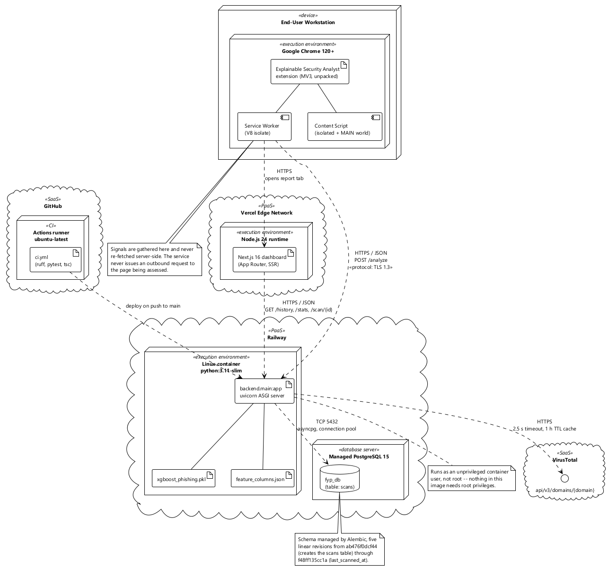

# Chapter 4 — Implementation

## 4.1 Technology selection

| Layer | Selection | Reasoning |
|---|---|---|
| Extension | Chrome Manifest V3, vanilla ES modules | MV2 is closed to new extensions. No framework was introduced: the popup has five states and one data source, and a framework would have added a build step and a dependency tree to solve a problem that does not exist here. |
| Service | Python 3.11, FastAPI 0.111, Uvicorn | The attribution library and the model library are Python-first, so any other choice would have meant a second process and a serialisation boundary on the request path. FastAPI validates at the edge and generates the OpenAPI description without extra work. |
| Model | XGBoost 2.0.3 | Tabular features, ~20k rows, no GPU. The decisive factor was attribution: `TreeExplainer` is exact for tree ensembles (ADR-002). |
| Attribution | SHAP 0.45.0 | Exact for the chosen model class; contributions sum to the prediction, which is the property the fusion design depends on. |
| Persistence | PostgreSQL 15, SQLAlchemy 2.0 async, Alembic | JSONB for variable-length payloads; a mature async driver; versioned migrations. |
| Dashboard | Next.js 16, React 19, TypeScript strict, Tailwind 4 | Server rendering for the initial view, static typing across the API boundary. |
| Container | Docker Compose | One command brings up database and service together (NFR-13). |
| CI | GitHub Actions | Lint, type-check and tests on every push (NFR-12). |

Version pinning is exact throughout the Python dependency set. This is not fussiness. Section 4.7.3
describes a binary-interface break between two libraries that a loose constraint admitted and an
exact pin now prevents.

### 4.1.1 Dependency placement

The dependency list distinguishes what the request path needs from what only training needs. This
distinction was originally wrong and is worth recording, because it produced a failure with no
symptom.

`shap_analysis.py` imports `pandas` and `joblib` at module scope, and the service imports that module
on every assessment. Both had been placed in the optional `[ml]` extra, and the container image
installed only the base dependency set. The imports were wrapped in `try`/`except ImportError` with a
fall-through to the heuristic path, so the container ran, answered requests, and returned verdicts —
with the model absent. Nothing logged an error at a level anyone would notice.

They are now base dependencies, on the principle that a library imported on the request path is not
optional in a serving container. The optional extra retains only what the offline pipeline needs:
XGBoost, SHAP and scikit-learn.

## 4.2 Deployment



*Figure 4.1 — Deployment topology.*

The model artefact is mounted read-only into the service container. It is excluded from version
control — a binary that changes with every training run is not something a repository should carry —
and is instead identified by its SHA-256 digest, which the health endpoint reports. That digest is
how a deployed instance is matched to the training run that produced its numbers.

Mount paths are a real source of error here. An earlier compose file mounted the artefact directory
at `/app/models` while the loader read `/app/ml/models`. The artefact was present in the image and
invisible to the code, which took the silent fallback path described above. Two defects compounding
in exactly the way ADR-016 was written to prevent.

## 4.3 Algorithms

### 4.3.1 Shannon entropy of a URL

Algorithmically generated hostnames — the output of a domain-generation algorithm, or a hashed
path segment — have a flatter character distribution than hand-chosen ones. Shannon entropy
measures this directly:

$$H(u) \;=\; -\sum_{c \in \Sigma_u} p(c)\,\log_2 p(c), \qquad p(c) = \frac{\operatorname{count}(c, u)}{|u|}$$

where $\Sigma_u$ is the set of distinct characters in URL $u$.

```
Algorithm 4.1 — Shannon entropy
Input:  text, a character string
Output: H, entropy in bits per character

1  if text is empty then return 0.0
2  freq ← empty map
3  for each character c in text do
4      freq[c] ← freq[c] + 1
5  n ← length(text)
6  H ← 0
7  for each count k in freq.values do
8      p ← k / n
9      H ← H − p · log₂(p)
10 return H
```

Linear in URL length, with the alphabet bounding the map. Typical values run from roughly 3.5 bits
for a short readable URL to above 5 bits for a long generated one. The feature is reported to four
decimal places; rounding further would discard real signal in the third decimal.

### 4.3.2 Brand impersonation

The check asks whether a well-known brand name appears somewhere in the URL while *not* being the
registrable domain. `paypal.com/login` is unremarkable. `paypal.security-check.tk/login` puts the
brand in a subdomain that PayPal does not control, and `secure-paypal.example.com` puts it in a
label. Both are caught; the legitimate case is not.

```
Algorithm 4.2 — Brand impersonation
Input:  url; BRANDS, a set of lowercase brand names
Output: 1 if a brand appears outside the registrable domain, else 0

1  host       ← hostname(url)
2  registrable ← registrable_domain_label(host)     ▷ eTLD+1, minus the suffix
3  u          ← lowercase(url)
4  for each b in BRANDS do
5      if b occurs in u and b ≠ registrable then
6          return 1
7  return 0
```

The comparison at line 5 against the registrable label rather than the full hostname is what keeps
the legitimate case clean. Extracting eTLD+1 correctly requires the Public Suffix List — a naive
"last two labels" rule mishandles `co.uk`, `com.au` and several hundred other suffixes — so the
implementation delegates to `tldextract`.

The check is deliberately literal. It does not detect homoglyphs (`paypa1`, `pаypal` with a Cyrillic
а) or edit-distance variants. Both are worthwhile extensions and are listed in Section 6.4; adding
them without evaluating their false-positive cost would have been the wrong order of work.

### 4.3.3 Tracker matching

EasyPrivacy rules of the form `||domain^` match the listed domain and every subdomain of it. A
request to `ssl.google-analytics.com` must therefore match a `google-analytics.com` entry. Two naive
implementations are tempting and both are wrong: exact set membership misses every subdomain, and
scanning the whole list per request is O(|list|) on a hot path that fires for every sub-resource on
every page.

Walking the domain's own ancestors is O(labels), which is small and bounded:

```
Algorithm 4.3 — Tracker base-domain resolution
Input:  hostname; TRACKERS, a hash set of listed base domains
Output: the matched base domain, or null

1  candidate ← hostname
2  while candidate ≠ empty do
3      if candidate ∈ TRACKERS then return candidate
4      i ← index of first "." in candidate
5      if i does not exist then return null
6      candidate ← candidate[i+1 …]
7  return null
```

Returning the *matched base domain* rather than a boolean matters for counting. Both
`ssl.google-analytics.com` and `www.google-analytics.com` resolve to `google-analytics.com`, are
added to a set, and are counted once. Counting hostnames instead would let a single tracker inflate
the count arbitrarily, and since the count feeds a fusion weight, that inflation would propagate
directly into the risk score.

### 4.3.4 Heuristic rule evaluation

```
Algorithm 4.4 — Heuristic evaluation
Input:  network_signals, permission_signals (either may be absent)
Output: flags, a list of rule names; features, a numeric map

1  features ← { tracker_count: 0, has_mixed_content: 0, redirect_chain_length: 0,
2               cam_mic_on_first_visit: 0, notification_prompt_on_load: 0,
3               location_on_load: 0 }
4  flags ← empty list
5  if network_signals present then
6      copy tracker_count, has_mixed_content, redirect_chain_length into features
7      if tracker_count > 10        then append "excessive_trackers"
8      if has_mixed_content         then append "has_mixed_content"
9      if redirect_chain_length > 3 then append "long_redirect_chain"
10 if permission_signals present then
11     for each r in {cam_mic_on_first_visit, notification_prompt_on_load, location_on_load} do
12         if r ∈ permission_signals.rule_flags then
13             append r to flags;  features[r] ← 1
14 return flags, features
```

The function returns both a flag list and a numeric map from one pass. The flags are for display and
the numeric map feeds fusion; deriving them separately would allow the two to disagree about the
same page.

The thresholds at lines 7 and 9 are stated in the source rather than tuned. Ten distinct tracker
base domains is high but not extraordinary for a commercial news site — the measurement recorded in
Section 5.5.4 found eleven on a major news domain. Three top-level redirects is well beyond what a
direct navigation requires. Both are documented as judgement calls, and both are inputs to the
sensitivity analysis in Section 5.9.

### 4.3.5 Log-odds fusion

This is the algorithm that realises ADR-014.

```
Algorithm 4.5 — Multi-signal fusion
Input:  p_url, the classifier's probability;  signals, the numeric heuristic map;
        W, the documented weight table;  G, the normalising transforms
Output: p_fused;  A, the browser-signal attributions

1  p ← clamp(p_url, ε, 1 − ε)                      ▷ ε = 1e-6, keeps the logit finite
2  z ← ln( p / (1 − p) )
3  A ← empty list
4  for each signal j in W do
5      v ← signals[j]
6      contribution ← W[j] · G[j](v)
7      if contribution ≠ 0 then
8          z ← z + contribution
9          append { feature: j, value: v, impact: contribution,
10                   text: format_reason(j, v, contribution) } to A
11 p_fused ← 1 / (1 + e^(−z))
12 return p_fused, A
```

Line 1 exists because a boosted ensemble can return a probability numerically equal to 0 or 1, and
the logit of either is infinite. Clamping to $\varepsilon = 10^{-6}$ bounds the log-odds at roughly
$\pm 13.8$, which is far outside any range the verdict bands distinguish.

Line 6 computes the attribution and line 8 applies it, in that order and from the same expression.
They cannot disagree. Had the score been accumulated in one place and the attribution recomputed in
another, the two would drift apart under any future edit, and the explanation would stop describing
the score it accompanies.

The transforms $G_j$ normalise unbounded counts. Tracker count uses a saturating transform so that
the fortieth tracker adds less than the fifth; redirect depth is treated similarly; the permission
flags are binary and pass through unchanged. Weights and transforms are tabulated with their
justification in `ml/reports/fusion_weights.md` and summarised in Appendix C.

### 4.3.6 Attribution and ranking

```
Algorithm 4.6 — Explanation assembly
Input:  feature_vector;  model;  explainer;  columns, the artefact's column manifest
Output: score, label, reasons

1  if any key in feature_vector is unknown to columns ∪ fusion signals then
2      raise UnknownFeatureError                     ▷ never drop silently
3  X ← row vector ordered by columns
4  p_url ← model.predict_proba(X)[1]
5  φ ← explainer.shap_values(X)                      ▷ additive log-odds contributions
6  R ← [ { feature: columns[i], value: X[i], impact: φ[i],
7          text: format_reason(columns[i], X[i], φ[i]) } for each i ]
8  p_fused, A ← FUSE(p_url, heuristic signals)       ▷ Algorithm 4.5
9  R ← R ∪ A
10 sort R by |impact| descending
11 label ← "phishing"   if p_fused > 0.70
12          "suspicious" if 0.40 ≤ p_fused ≤ 0.70
13          "legitimate" otherwise
14 return p_fused, label, first 3 of R
```

Line 1 deserves emphasis because its absence caused the most consequential defect in the project.
The original implementation built its row with `{col: vector.get(col, -1) for col in columns}`, which
takes what it recognises and discards the rest without a word. Every browser signal vanished at that
line. Section 4.7.2 gives the full account.

Line 9 unions the two attribution families before sorting, so a browser signal outranks a weak model
feature whenever its contribution is larger. Nothing privileges either source.

## 4.4 Extension implementation

### 4.4.1 State under an ephemeral service worker

MV3 service workers are terminated when idle, without warning, and restarted on the next event.
Module-scope variables do not survive. The design consequence is that anything needed across events
must live in extension storage.

`NetworkMonitor` holds its per-tab accumulator in memory during the load, which is a deliberate
exception: writing to storage on every completed sub-resource would mean hundreds of asynchronous
writes for a heavy page. The accumulator is frozen to storage once, on load completion, keyed by tab
identifier. If the worker is terminated mid-load the signals for that page are lost and the
assessment proceeds without them, which degrades the assessment rather than breaking it.

### 4.4.2 Correct redirect counting

Redirect counting filters on `frameId === 0`. Without that filter, every advertisement iframe
performing its own redirect chain increments the counter, and a heavily monetised but entirely
legitimate news page registers a redirect depth in the dozens. The signal is meant to capture
concealment of a final destination, which is a property of the top-level navigation only.

### 4.4.3 Permission interception and the isolated world

Content scripts execute in an isolated world: a separate JavaScript context that shares the DOM with
the page but not its script environment. Patching `Notification.requestPermission` there replaces the
function in the isolated context, where the page never looks. The page's own call goes to the
original.

This was a genuine defect rather than an incomplete feature. The permission signal family was wired
end to end — collected, transmitted, evaluated, rendered — and observed nothing, because the
interception could not see the calls it was meant to observe. The fix is a second content-script
entry in the manifest declaring `"world": "MAIN"`, so `permission_monitor.js` executes in the same
context as the page's own script and can patch `Notification.requestPermission`,
`navigator.mediaDevices.getUserMedia` and `navigator.geolocation.getCurrentPosition` where the page
actually calls them. The main-world script cannot call `chrome.runtime` directly, so it dispatches a
`CustomEvent` that the isolated-world `content_script.js` relays onward — the only channel available
between the two worlds.

A second, independent problem sits alongside it: ordering. Permission signals are posted a few
seconds after load, while assessment fires on load completion, so the signals arrive after the
request has gone. Resolving this without delaying every assessment for a window that usually
produces nothing meant re-assessing on arrival instead: `background.js` tracks which rule flags were
already known at the time of the last assessment and triggers a fresh one only when a flag it had
not seen before appears. Both fixes are recorded in Section 4.7 and their residual scope — automated
coverage exists, but a real-browser confirmation is still outstanding — in Section 6.3.

## 4.5 Service implementation

### 4.5.1 Validation at the boundary

Request bodies are validated by Pydantic models before any handler code runs. `url` is typed as
`HttpUrl`, counts carry `ge=0` constraints, and unknown fields are rejected. A malformed submission
produces 422 with the offending field named, and no code downstream has to defend against a missing
key or a negative count.

### 4.5.2 Reputation client

The client is asynchronous with a five-second timeout and a TTL cache holding 256 entries for one
hour. Every failure path — absent key, timeout, transport error, unexpected payload shape,
non-numeric votes — returns the same sentinel triple of −1 values. There is exactly one degraded
representation, so no consumer has to distinguish a timeout from a missing key.

The sentinel is −1 rather than `null` or 0 because these fields are numeric on the wire and 0 is a
meaningful value: zero malicious votes is a real, and reassuring, observation. Conflating "no vendor
flagged this" with "we could not ask" would have been a quiet correctness bug in the display layer.

### 4.5.3 Health endpoint

The health endpoint queries model state and database reachability through functions that are
guaranteed not to raise. A health check that can itself fail is not a health check. `get_model_status`
returns a negative report rather than propagating a load error, and `check_db_reachable` executes
`SELECT 1` inside a try block.

## 4.6 Dashboard implementation

TypeScript runs in strict mode with `any` prohibited. Every response shape is declared once in
`lib/types.ts` and shared by the client and the components, so a change to the service contract
surfaces as a compile error rather than as an undefined value at run time. The type-check runs in CI
(NFR-12).

Presentation components receive `human_readable` and render it. None inspects `feature`. ADR-010 is
therefore enforced by the shape of the component interface rather than by reviewer vigilance.

## 4.7 Defects encountered and their resolution

This section documents faults found during development. It is included in full, including the ones
that were embarrassing, because the reasoning that surfaced them is a more useful record than a
tidied account would be — and because two of them were invisible in every test that existed at the
time.

### 4.7.1 D1 — A corpus that was separable for the wrong reason

**Symptom.** Cross-validated F1 around 0.97 on the first trained model. Suspiciously good for a task
this hard.

**Cause.** The corpus was assembled from two sources with incompatible shapes. Malicious rows came
from PhishTank as complete URLs with paths and query strings. Benign rows were constructed from a
domain-ranking list by prefixing `https://` to a bare domain. Every benign URL was therefore short
and path-free; every malicious one was long and path-bearing.

`url_length` alone came close to solving the task. The model had learned to detect the presence of a
path.

**Consequences had it shipped.** The reported metric would have been meaningless, which is the
academic failure. The deployment failure would have been worse and immediate: every legitimate deep
link — a repository file view, an encyclopaedia article, any documentation page — presents as a long
path-bearing URL and would have been flagged. The system would have been unusable on precisely the
pages people spend their time reading.

**Resolution.** An audit script was written to quantify the artefact rather than merely to remove it.
For every feature it reports standalone ROC-AUC, class-conditional means, and the proportion of URLs
in each class carrying a non-trivial path. Any feature exceeding 0.90 AUC on its own is flagged. The
corpus was then rebuilt against a path-bearing benign source, and the audit re-run. The
before-and-after pair is reported in Section 5.4.

The domain-ranking list was retained, but repurposed: its top thousand entries, with real deep paths,
now form a held-out false-positive evaluation set. It answers the question "does this flag
Wikipedia?" with a number.

**What the episode changed.** The audit is now a gate in the pipeline (Figure 2.7), placed before
feature extraction. It runs before a classifier ever sees the data, because a metric that already
exists is much harder to abandon than one that does not.

### 4.7.2 D2 — Browser signals discarded in silence

**Symptom.** None. Every test passed. The API returned well-formed responses with sensible verdicts.

**Cause.** The router computed heuristic features, merged them into the feature vector, and passed
the result to the attribution layer, which built its input row with:

```python
row = {col: feature_vector.get(col, -1) for col in feature_columns}
```

`feature_columns` lists only the trained lexical columns. The comprehension takes those and drops
everything else. Every browser signal — tracker count, mixed content, redirect depth, all three
permission flags — was discarded at that line, with no log entry and no error.

The signals survived elsewhere as display strings in `flagged_rules`, which is why the defect was
invisible: the popup showed "More than 10 third-party tracking domains were detected", so the
signals appeared to be working. They were being shown and not used.

**Consequences.** Claim C2 was false for as long as this stood. The system's central assertion — that
detection is genuinely multi-signal — was contradicted by one line of dictionary comprehension.

**Resolution.** Two changes. The attribution layer now raises on any key it does not recognise, so a
feature can never again disappear quietly; the general rule adopted is that dropping data is an
error unless dropping it was explicitly requested. And the fusion layer of Section 4.3.5 gives the
browser signals a defined route into the score, which is what they lacked.

**What the episode changed.** It is the clearest illustration in this project of why silent
degradation is worse than failure. A crash here would have been found in an hour. The silence cost
weeks and would have survived into the viva unnoticed.

### 4.7.3 D3 — A binary-interface break admitted by a loose pin

**Symptom.** `AttributeError: _ARRAY_API not found` on importing the service, after a routine
dependency install.

**Cause.** The numerical library was unpinned. The resolver selected its current major version, whose
compiled interface is incompatible with the extensions shipped by the pinned attribution library,
which was built against the previous major version.

**Resolution.** An explicit upper bound on the numerical library, with a comment on the line stating
why it exists. A version constraint without a recorded reason gets removed by the next person to
read it.

**Related.** The interpreter itself was the same class of problem. The system Python was too recent
for several pinned scientific packages to have prebuilt wheels, so installation attempted a source
build and failed for want of a compiler. The project standardised on Python 3.11, and the CI
configuration pins that version so the environment cannot drift.

### 4.7.4 D4 — Artefact and manifest out of step

**Symptom.** The column manifest listed twelve features. The generated feature file had eight. No
model existed to match either.

**Cause.** The manifest had been edited by hand at some point after training.

**Resolution.** The manifest and the artefact are written by one execution and neither is edited
afterwards. Loading asserts that the model's input arity equals the manifest length and reports both
values on mismatch. The assertion is three lines and would have caught this the first time.

### 4.7.5 D5 — Four routes to a silent fallback

Described in Section 3.2.5. Resolved by ADR-016: the attribution entry point raises unless an
explicit development override is set, the router maps that to 503, and the health endpoint reports
the model state that was previously unobservable.

The distinction that matters here is between development and deployment. During development the
fallback is useful — the service is usable before a model exists, which is how the interface was
built at all. In a deployment it is a liability. One environment variable separates the two, and the
container configuration for local development sets it explicitly and comments why.

### 4.7.6 D6 — A missing permission that failed quietly

**Symptom.** All network signals were zero. No error in the console.

**Cause.** The manifest omitted the `webNavigation` permission while the monitor registered a
`webNavigation.onBeforeNavigate` listener. The registration throws, the module's remaining listeners
are never attached, and the accumulator is never initialised.

**Resolution.** The permission was added. The broader lesson was that extension permissions and API
usage need to be checked against each other, since the failure mode is a listener that is simply
never called.

### 4.7.7 D7 and D8 — Permission signals: wrong context, wrong time

Both described in Section 4.4.3. D7 is the isolated-world interception, which observed nothing. D8 is
the ordering race, in which signals were posted after the assessment had already been requested. They
were independent faults with the same consequence, and either alone was sufficient to render the
permission family inoperative.

**Resolution.** D7: `permission_monitor.js` moved to the main world via the manifest's `"world":
"MAIN"` declaration, relaying observed calls to the isolated world through a `CustomEvent` bridge — a
cross-realm test exercises the full relay via two linked VM contexts. D8: `background.js` now
re-runs the assessment when a rule flag arrives that was not present at the time of the previous run,
rather than delaying every assessment to wait for a signal that, for most pages, never comes.
Automated coverage exists for both; a real-browser session confirming the interception observes an
actual page's own permission prompt has not yet been run, and is recorded as an open item in Section
6.3 rather than presented as a completed verification it is not.

### 4.7.8 A test that concealed correct behaviour

Worth recording as a counter-example to the pattern above.

A unit test for the reputation client asserted a vote count of 3 and received −1. The natural reading
is a bug in the client. The actual cause was in the test: the response object was mocked as
asynchronous, so calling its synchronous JSON accessor returned an un-awaited coroutine rather than a
payload. The client's type guard correctly rejected the non-dictionary and returned its sentinel. The
production code was right and the test was wrong.

The general point is that a failing test is evidence about the system, not proof about the code under
test. Reading it the other way round would have led to "fixing" a correct type guard.

## 4.8 Development practice

Work was tracked against a sprint plan in which every task carries an acceptance criterion that can
be executed. A task is complete when its criterion has been run and observed, not when the code
compiles. The distinction is what caught D5: the code for the model-loading path had been written and
reviewed, but the criterion — query the health endpoint and confirm the reported state — had not been
executed, and executing it was what revealed the mount-path error.

Every function in the codebase carries exactly one single-line comment above it stating what it does.
The constraint is deliberately tight: a function whose purpose does not fit on one line is usually
doing more than one thing, so the comment doubles as a design check.

Continuous integration runs lint, the full test suite, and the dashboard type-check on every push.
Its first execution failed, and the failure is instructive. Local runs had used `python -m pytest`,
which places the working directory on the import path; CI used the bare `pytest` entry point, which
does not. Five test modules failed to import. The fix was a two-line configuration file, but the
diagnosis is the useful part: the local command and the CI command were not the same command, so
local success had never been evidence about CI.
