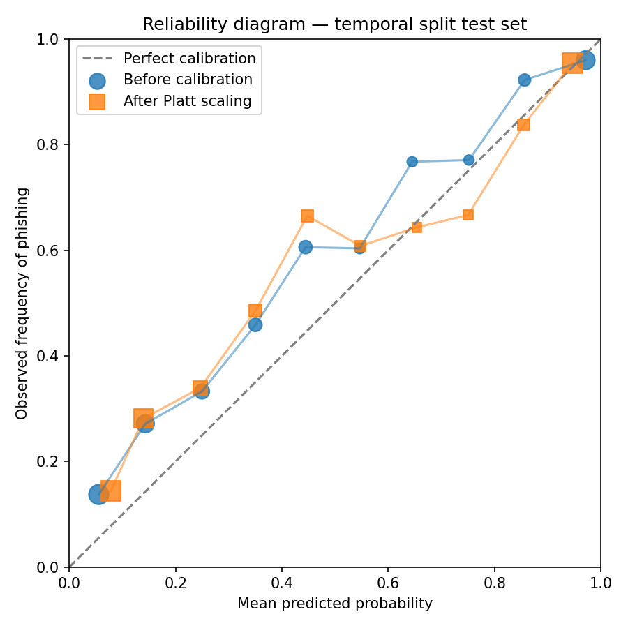

# Evaluation report — baseline comparison and split protocols

Measured on `ml/data/processed/features.csv` (19,685 rows). Both protocols are harder than a random split and are the ones this project's claims rest on — see the module docstring in `ml/scripts/evaluate_baselines.py` for why each is constructed the way it is.

## Temporal split

Train: 15748 rows (8000 phishing). Test: 3937 rows (2000 phishing).

| Baseline | Precision | Recall | F1 | ROC-AUC |
|---|---|---|---|---|
| B1 Blocklist lookup | 0.000 | 0.000 | 0.000 | 0.500 |
| B2 url_length only | 0.668 | 0.494 | 0.568 | 0.674 |
| B3 Logistic regression | 0.828 | 0.666 | 0.739 | 0.827 |
| B4 XGBoost (URL-only) | 0.873 | 0.621 | 0.726 | 0.852 |

**B1's recall on this test set is 0.0%.** By construction of the split, every test URL is absent from the training blocklist — this number *is* "recall on URLs absent from the blocklist," which is the direct quantitative answer to "why not just use a blocklist?" (claim C1).

## Unseen-registrable-domain split

Train: 16214 rows (8507 phishing). Test: 3471 rows (1493 phishing).

| Baseline | Precision | Recall | F1 | ROC-AUC |
|---|---|---|---|---|
| B1 Blocklist lookup | 0.000 | 0.000 | 0.000 | 0.500 |
| B2 url_length only | 0.468 | 0.413 | 0.439 | 0.574 |
| B3 Logistic regression | 0.717 | 0.617 | 0.663 | 0.794 |
| B4 XGBoost (URL-only) | 0.807 | 0.591 | 0.683 | 0.839 |

**B1's recall on this test set is 0.0%.** By construction of the split, every test URL is absent from the training blocklist — this number *is* "recall on URLs absent from the blocklist," which is the direct quantitative answer to "why not just use a blocklist?" (claim C1).

## Confusion matrix — B4 XGBoost, temporal split

| | Predicted legitimate | Predicted phishing |
|---|---|---|
| **Actually legitimate** | 1756 | 181 |
| **Actually phishing** | 758 | 1242 |

## Note on the fused model (no B5 row)

There is no offline measurement of the fused model's detection performance, because no corpus — this one included — carries real per-URL browser telemetry (tracker counts, redirect depth, permission timings) alongside a phishing label. Fabricating that telemetry to produce a B5 number would be exactly the kind of manufactured evidence ADR-014 explicitly rejects for the fusion weights themselves. B4 above **is** the fused model's URL-scoring component; claim C2 (that browser signals measurably move the score) is validated instead by a live test — `tests/unit/test_risk_fusion.py` and `tests/unit/test_shap.py::test_adverse_browser_signals_raise_the_score` — and by the end-to-end validation against live URLs in Sprint 3.

## Calibration — temporal split test set

Measured on 3937 test URLs (2000 phishing). 10 equal-width bins.

| Metric | Before | After Platt scaling |
|---|---|---|
| Brier score | 0.1622 | 0.1647 |
| Expected Calibration Error | 0.0821 | 0.0799 |

| Bin | Mean predicted | Observed accuracy | Count |
|---|---|---|---|
| 0.0–0.1 | 0.055 | 0.137 | 830 |
| 0.1–0.2 | 0.143 | 0.271 | 645 |
| 0.2–0.3 | 0.250 | 0.333 | 418 |
| 0.3–0.4 | 0.350 | 0.459 | 314 |
| 0.4–0.5 | 0.444 | 0.606 | 307 |
| 0.5–0.6 | 0.546 | 0.604 | 169 |
| 0.6–0.7 | 0.645 | 0.768 | 142 |
| 0.7–0.8 | 0.752 | 0.771 | 144 |
| 0.8–0.9 | 0.857 | 0.922 | 245 |
| 0.9–1.0 | 0.971 | 0.960 | 723 |

Platt scaling was fitted because ECE (0.0821) exceeded 0.05. It improved calibration (0.0821 → 0.0799).

## Explanation faithfulness — top-3 SHAP ablation (claim C3)

For each of 3937 temporal-split test URLs, the top-3 SHAP-attributed features were neutralised to their training medians and the URL re-scored. Both shifts are measured in log-odds, the space SHAP natively attributes in.

| Metric | Value |
|---|---|
| URLs evaluated | 3937 |
| Mean absolute error (predicted vs. observed shift) | 0.9913 |
| Directional agreement (all cases) | 87.0% |
| Directional agreement (\|predicted shift\| > 0.05, n=3920) | 87.1% |

Acceptance target: ≥ 90% directional agreement. Not met on the full set (87.0%).

Exact agreement between predicted and observed shift is not expected: SHAP attributes a *specific* prediction under the *observed* feature distribution, and simultaneously intervening on three features moves the input off that distribution on a model that is not additive in its inputs. Directional agreement is the criterion that actually tests faithfulness; the MAE quantifies the size of the resulting interaction effects.

## False positives on the deep-path holdout

Measured on `ml/data/processed/fp_holdout.csv` — 1488 real deep-path URLs, disjoint domains from every training URL (see `ml/data/raw/DATASET_SOURCES.md`). Scored through the live `ml.shap_analysis.explain_prediction()` path, the same code the service calls.

| Band | Count | Rate |
|---|---|---|
| legitimate | 1161 | 78.0% |
| suspicious | 201 | 13.5% |
| **phishing** | **126** | **8.5%** |

A 8.5% false-positive rate in the phishing band (the band that raises the blocking interstitial, §3.7.2) on popular, legitimate, previously-unseen URLs is a genuine, measured limitation — see `ml/reports/training_log.md` for the investigation into individual misfires. Not tuned away against this same holdout, which would fit to the measurement instrument rather than the underlying problem.

## Latency — POST /analyze

Measured against `http://127.0.0.1:8000` (10 distinct domains, real model loaded). Cold pass paced at one request per 16s to stay under VirusTotal's free-tier rate limit rather than measuring how fast VT rejects an over-limit burst; warm pass repeats the same domains immediately after, against the 1-hour TTL cache.

| Condition | p50 | p95 | NFR-01 budget |
|---|---|---|---|
| Cold VT cache | 1.148s | 1.593s | ≤ 10s |
| Warm VT cache | 0.063s | 0.078s | ≤ 1s |

Met (cold), met (warm) against NFR-01.

